# TaskFlow: Design, Implementation and Testing Document

**An AI-Powered Project Management Platform for Student Teams**

**Group 2 -- Group 2**

SC6105 Software Engineering

Nanyang Technological University

May 2026

---

## Revision History

| Version | Date     | Author  | Description                       |
| ------- | -------- | ------- | --------------------------------- |
| 1.0     | May 2026 | Group 2 | Initial Design & Testing document |

---

## Table of Contents

1. [Introduction](#1-introduction)
   - 1.1 [Purpose](#11-purpose)
   - 1.2 [Scope](#12-scope)
   - 1.3 [Definitions, Acronyms, and Abbreviations](#13-definitions-acronyms-and-abbreviations)
   - 1.4 [References](#14-references)
   - 1.5 [Overview](#15-overview)
2. [System Architecture](#2-system-architecture)
   - 2.1 [Architecture Overview](#21-architecture-overview)
   - 2.2 [Three-Tier Architecture Diagram](#22-three-tier-architecture-diagram)
   - 2.3 [Component Diagram](#23-component-diagram)
   - 2.4 [Deployment Diagram](#24-deployment-diagram)
   - 2.5 [Technology Stack](#25-technology-stack)
3. [Complete Class Diagrams](#3-complete-class-diagrams)
   - 3.1 [Overall System Class Diagram](#31-overall-system-class-diagram)
   - 3.2 [User Authentication Module](#32-user-authentication-module)
   - 3.3 [Project Management Module](#33-project-management-module)
   - 3.4 [Kanban Board Module](#34-kanban-board-module)
   - 3.5 [AI Task Decomposition Module](#35-ai-task-decomposition-module)
   - 3.6 [Notification System Module](#36-notification-system-module)
   - 3.7 [Data Analytics Module](#37-data-analytics-module)
   - 3.8 [Frontend Component Class Diagram](#38-frontend-component-class-diagram)
4. [Complete Sequence Diagrams](#4-complete-sequence-diagrams)
   - 4.1 [User Registration](#41-user-registration)
   - 4.2 [User Login](#42-user-login)
   - 4.3 [Create Project](#43-create-project)
   - 4.4 [Invite Team Members](#44-invite-team-members)
   - 4.5 [Create Task](#45-create-task)
   - 4.6 [Move Task (Drag-and-Drop)](#46-move-task-drag-and-drop)
   - 4.7 [AI Task Decomposition](#47-ai-task-decomposition)
   - 4.8 [Deadline Reminder Notification](#48-deadline-reminder-notification)
   - 4.9 [View Analytics Dashboard](#49-view-analytics-dashboard)
   - 4.10 [Password Reset](#410-password-reset)
5. [Complete Dialog Map](#5-complete-dialog-map)
   - 5.1 [Overall Application Navigation Flow](#51-overall-application-navigation-flow)
   - 5.2 [Task Lifecycle State Machine](#52-task-lifecycle-state-machine)
   - 5.3 [Authentication Flow Dialog Map](#53-authentication-flow-dialog-map)
   - 5.4 [Project Management Dialog Map](#54-project-management-dialog-map)
6. [Database Design](#6-database-design)
   - 6.1 [Entity-Relationship Diagram](#61-entity-relationship-diagram)
   - 6.2 [Database Schema](#62-database-schema)
7. [API Design](#7-api-design)
   - 7.1 [RESTful API Endpoints](#71-restful-api-endpoints)
   - 7.2 [WebSocket Events](#72-websocket-events)
8. [Application Skeleton](#8-application-skeleton)
   - 8.1 [Project Structure](#81-project-structure)
   - 8.2 [Backend Skeleton Code](#82-backend-skeleton-code)
   - 8.3 [Frontend Skeleton Code](#83-frontend-skeleton-code)
   - 8.4 [Database Models](#84-database-models)
9. [Testing](#9-testing)
   - 9.1 [Testing Strategy](#91-testing-strategy)
   - 9.2 [Unit Test Cases](#92-unit-test-cases)
   - 9.3 [Integration Test Cases](#93-integration-test-cases)
   - 9.4 [System Test Cases](#94-system-test-cases)
   - 9.5 [Test Coverage Matrix](#95-test-coverage-matrix)
10. [Appendix](#10-appendix)
    - 10.1 [Design Patterns Used](#101-design-patterns-used)
    - 10.2 [Design Decisions and Rationale](#102-design-decisions-and-rationale)

---

## 1. Introduction

### 1.1 Purpose

This Design, Implementation and Testing document provides the complete technical design for TaskFlow, an AI-powered project management platform for NTU student teams. It translates the requirements specified in the Software Requirements Specification (SRS v2.0) into actionable design artifacts including class diagrams, sequence diagrams, dialog maps, system architecture, application skeleton code, and comprehensive test cases.

This document serves as the primary reference for the development team during the implementation phase and for the QA team during the testing phase.

### 1.2 Scope

TaskFlow is a web-based project management platform providing:

- **Kanban-style task board** with drag-and-drop functionality
- **AI-powered task decomposition** that breaks high-level objectives into actionable subtasks
- **Integrated notification system** with email and in-app alerts
- **Data analytics dashboard** with burndown charts and workload visualizations
- **User authentication** with JWT-based security and role-based access control

This document covers the design of all six functional modules: User Authentication, Project Management, Kanban Board, AI Task Decomposition, Notification System, and Data Analytics.

### 1.3 Definitions, Acronyms, and Abbreviations

| Term | Definition                          |
| ---- | ----------------------------------- |
| API  | Application Programming Interface   |
| DnD  | Drag and Drop                       |
| DTO  | Data Transfer Object                |
| ER   | Entity-Relationship                 |
| JWT  | JSON Web Token                      |
| LLM  | Large Language Model                |
| MVC  | Model-View-Controller               |
| ORM  | Object-Relational Mapping           |
| REST | Representational State Transfer     |
| SPA  | Single Page Application             |
| SRS  | Software Requirements Specification |
| TLS  | Transport Layer Security            |
| UI   | User Interface                      |
| UML  | Unified Modeling Language           |
| WS   | WebSocket                           |

### 1.4 Overview

This document is organized as follows:

- **Section 2** presents the overall system architecture including deployment and component diagrams.
- **Section 3** contains complete class diagrams for all modules.
- **Section 4** provides sequence diagrams for all major use cases.
- **Section 5** describes the dialog map and state machines.
- **Section 6** covers database design with ER diagram and schema.
- **Section 7** documents the API design.
- **Section 8** presents the application skeleton code.
- **Section 9** contains the testing strategy and test cases.
- **Section 10** is the appendix with design patterns and rationale.

---

## 2. System Architecture

### 2.1 Architecture Overview

TaskFlow adopts a **three-tier client-server architecture** consisting of a Presentation Tier (React SPA), an Application Tier (FastAPI backend), and a Data Tier (PostgreSQL database). The backend additionally orchestrates two external services: an LLM API for AI task decomposition and SendGrid for email notifications. Real-time communication between the frontend and backend is achieved via WebSocket connections.

### 2.2 Three-Tier Architecture Diagram

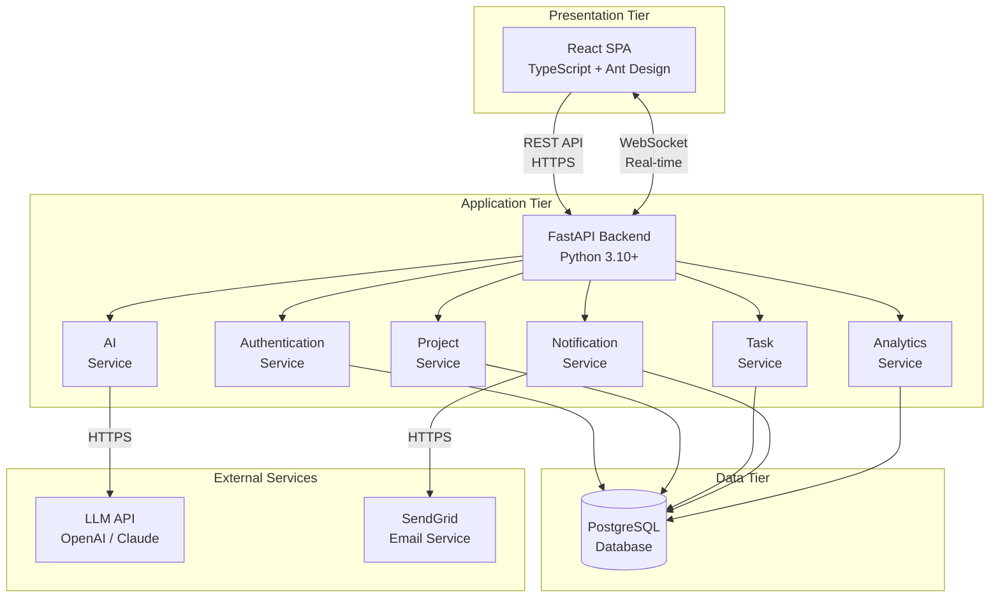
```mermaid
graph TB
    subgraph "Presentation Tier"
        A[React SPA<br/>TypeScript + Ant Design]
    end

    subgraph "Application Tier"
        B[FastAPI Backend<br/>Python 3.10+]
        C[Authentication<br/>Service]
        D[Project<br/>Service]
        E[Task<br/>Service]
        F[AI<br/>Service]
        G[Notification<br/>Service]
        H[Analytics<br/>Service]
    end

    subgraph "Data Tier"
        I[(PostgreSQL<br/>Database)]
    end

    subgraph "External Services"
        J[LLM API<br/>OpenAI / Claude]
        K[SendGrid<br/>Email Service]
    end

    A -->|REST API<br/>HTTPS| B
    A <-->|WebSocket<br/>Real-time| B
    B --> C
    B --> D
    B --> E
    B --> F
    B --> G
    B --> H
    C --> I
    D --> I
    E --> I
    G --> I
    H --> I
    F -->|HTTPS| J
    G -->|HTTPS| K
```

_Figure 1: TaskFlow Three-Tier Architecture Diagram_

### 2.3 Component Diagram

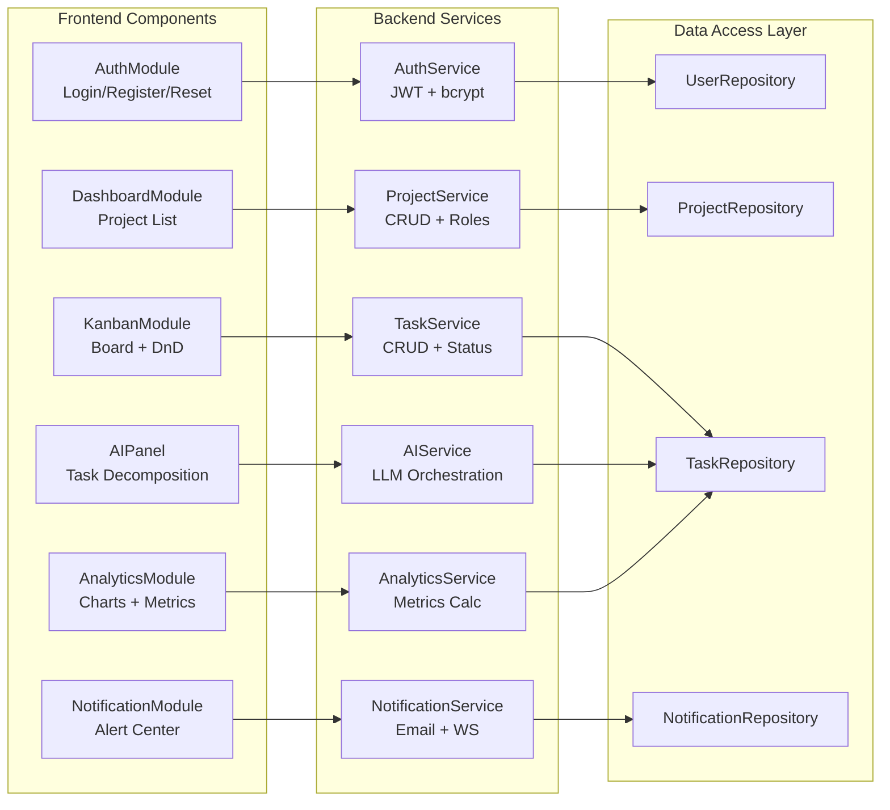
```mermaid
graph LR
    subgraph "Frontend Components"
        FC1[AuthModule<br/>Login/Register/Reset]
        FC2[DashboardModule<br/>Project List]
        FC3[KanbanModule<br/>Board + DnD]
        FC4[AIPanel<br/>Task Decomposition]
        FC5[AnalyticsModule<br/>Charts + Metrics]
        FC6[NotificationModule<br/>Alert Center]
    end

    subgraph "Backend Services"
        BS1[AuthService<br/>JWT + bcrypt]
        BS2[ProjectService<br/>CRUD + Roles]
        BS3[TaskService<br/>CRUD + Status]
        BS4[AIService<br/>LLM Orchestration]
        BS5[NotificationService<br/>Email + WS]
        BS6[AnalyticsService<br/>Metrics Calc]
    end

    subgraph "Data Access Layer"
        DA1[UserRepository]
        DA2[ProjectRepository]
        DA3[TaskRepository]
        DA4[NotificationRepository]
    end

    FC1 --> BS1
    FC2 --> BS2
    FC3 --> BS3
    FC4 --> BS4
    FC5 --> BS6
    FC6 --> BS5

    BS1 --> DA1
    BS2 --> DA2
    BS3 --> DA3
    BS4 --> DA3
    BS5 --> DA4
    BS6 --> DA3
```

_Figure 2: Component Diagram showing Frontend-Backend-Data mapping_

### 2.4 Deployment Diagram

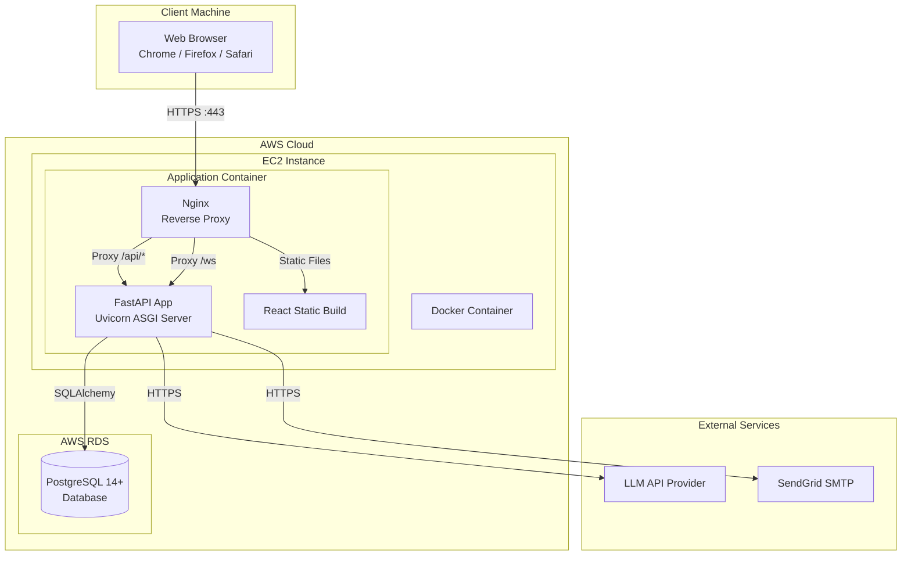
```mermaid
graph TB
    subgraph "Client Machine"
        Browser[Web Browser<br/>Chrome / Firefox / Safari]
    end

    subgraph "AWS Cloud"
        subgraph "EC2 Instance"
            Docker[Docker Container]
            subgraph "Application Container"
                Nginx[Nginx<br/>Reverse Proxy]
                FastAPI_App[FastAPI App<br/>Uvicorn ASGI Server]
                React_Build[React Static Build]
            end
        end
        subgraph "AWS RDS"
            PG[(PostgreSQL 14+<br/>Database)]
        end
    end

    subgraph "External Services"
        LLM[LLM API Provider]
        SG[SendGrid SMTP]
    end

    Browser -->|HTTPS :443| Nginx
    Nginx -->|Static Files| React_Build
    Nginx -->|Proxy /api/*| FastAPI_App
    Nginx -->|Proxy /ws| FastAPI_App
    FastAPI_App -->|SQLAlchemy| PG
    FastAPI_App -->|HTTPS| LLM
    FastAPI_App -->|HTTPS| SG
```

_Figure 3: Deployment Diagram_

### 2.5 Technology Stack

| Layer        | Technology              | Version | Purpose                                   |
| ------------ | ----------------------- | ------- | ----------------------------------------- |
| Frontend     | React                   | 18+     | Component-based SPA framework             |
| Language     | TypeScript              | 5.0+    | Type-safe frontend development            |
| UI Framework | Ant Design              | 5.x     | Professional UI component library         |
| Drag & Drop  | react-beautiful-dnd     | 13.x    | Accessible Kanban board interactions      |
| Charts       | Recharts                | 2.x     | Responsive data visualization             |
| State Mgmt   | React Context + Hooks   | --      | Lightweight state management              |
| HTTP Client  | Axios                   | 1.x     | REST API communication                    |
| Backend      | Python FastAPI          | 0.100+  | High-performance async API framework      |
| ORM          | SQLAlchemy              | 2.0+    | Database ORM with async support           |
| Migrations   | Alembic                 | 1.x     | Database schema migrations                |
| Database     | PostgreSQL              | 14+     | Relational database                       |
| Auth         | python-jose + bcrypt    | --      | JWT token generation and password hashing |
| Email        | SendGrid SDK            | 6.x     | Transactional email delivery              |
| AI           | OpenAI / Anthropic SDK  | --      | LLM API for task decomposition            |
| Deployment   | Docker + Docker Compose | --      | Containerized deployment                  |
| Web Server   | Nginx                   | 1.24+   | Reverse proxy and static file serving     |
| ASGI Server  | Uvicorn                 | 0.27+   | ASGI server for FastAPI                   |

---

## 3. Complete Class Diagrams

### 3.1 Overall System Class Diagram

The following diagram shows all major domain classes and their relationships across the entire TaskFlow system.

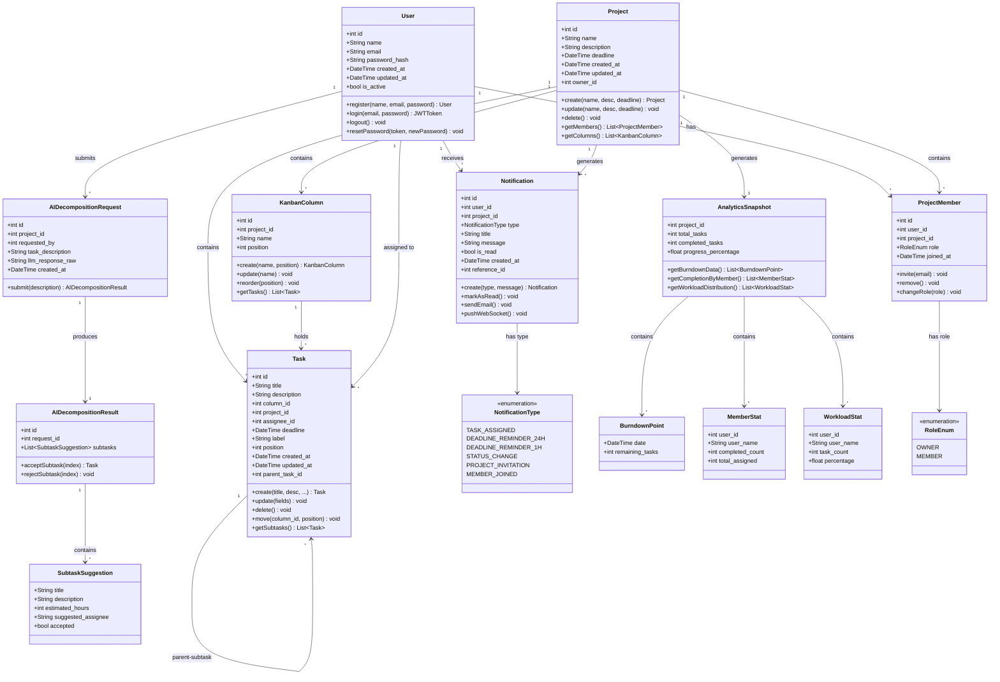
```mermaid
classDiagram
    class User {
        +int id
        +String name
        +String email
        +String password_hash
        +DateTime created_at
        +DateTime updated_at
        +bool is_active
        +register(name, email, password) User
        +login(email, password) JWTToken
        +logout() void
        +resetPassword(token, newPassword) void
    }

    class Project {
        +int id
        +String name
        +String description
        +DateTime deadline
        +DateTime created_at
        +DateTime updated_at
        +int owner_id
        +create(name, desc, deadline) Project
        +update(name, desc, deadline) void
        +delete() void
        +getMembers() List~ProjectMember~
        +getColumns() List~KanbanColumn~
    }

    class ProjectMember {
        +int id
        +int user_id
        +int project_id
        +RoleEnum role
        +DateTime joined_at
        +invite(email) void
        +remove() void
        +changeRole(role) void
    }

    class KanbanColumn {
        +int id
        +int project_id
        +String name
        +int position
        +create(name, position) KanbanColumn
        +update(name) void
        +reorder(position) void
        +getTasks() List~Task~
    }

    class Task {
        +int id
        +String title
        +String description
        +int column_id
        +int project_id
        +int assignee_id
        +DateTime deadline
        +String label
        +int position
        +DateTime created_at
        +DateTime updated_at
        +int parent_task_id
        +create(title, desc, ...) Task
        +update(fields) void
        +delete() void
        +move(column_id, position) void
        +getSubtasks() List~Task~
    }

    class AIDecompositionRequest {
        +int id
        +int project_id
        +int requested_by
        +String task_description
        +String llm_response_raw
        +DateTime created_at
        +submit(description) AIDecompositionResult
    }

    class AIDecompositionResult {
        +int id
        +int request_id
        +List~SubtaskSuggestion~ subtasks
        +acceptSubtask(index) Task
        +rejectSubtask(index) void
    }

    class SubtaskSuggestion {
        +String title
        +String description
        +int estimated_hours
        +String suggested_assignee
        +bool accepted
    }

    class Notification {
        +int id
        +int user_id
        +int project_id
        +NotificationType type
        +String title
        +String message
        +bool is_read
        +DateTime created_at
        +int reference_id
        +create(type, message) Notification
        +markAsRead() void
        +sendEmail() void
        +pushWebSocket() void
    }

    class NotificationType {
        <<enumeration>>
        TASK_ASSIGNED
        DEADLINE_REMINDER_24H
        DEADLINE_REMINDER_1H
        STATUS_CHANGE
        PROJECT_INVITATION
        MEMBER_JOINED
    }

    class AnalyticsSnapshot {
        +int project_id
        +int total_tasks
        +int completed_tasks
        +float progress_percentage
        +getBurndownData() List~BurndownPoint~
        +getCompletionByMember() List~MemberStat~
        +getWorkloadDistribution() List~WorkloadStat~
    }

    class BurndownPoint {
        +DateTime date
        +int remaining_tasks
    }

    class MemberStat {
        +int user_id
        +String user_name
        +int completed_count
        +int total_assigned
    }

    class WorkloadStat {
        +int user_id
        +String user_name
        +int task_count
        +float percentage
    }

    class RoleEnum {
        <<enumeration>>
        OWNER
        MEMBER
    }

    User "1" --> "*" ProjectMember : has
    Project "1" --> "*" ProjectMember : contains
    Project "1" --> "*" KanbanColumn : contains
    Project "1" --> "*" Task : contains
    KanbanColumn "1" --> "*" Task : holds
    User "1" --> "*" Task : assigned to
    Task "1" --> "*" Task : parent-subtask
    User "1" --> "*" Notification : receives
    Project "1" --> "*" Notification : generates
    User "1" --> "*" AIDecompositionRequest : submits
    AIDecompositionRequest "1" --> "1" AIDecompositionResult : produces
    AIDecompositionResult "1" --> "*" SubtaskSuggestion : contains
    ProjectMember --> RoleEnum : has role
    Notification --> NotificationType : has type
    Project "1" --> "1" AnalyticsSnapshot : generates
    AnalyticsSnapshot --> "*" BurndownPoint : contains
    AnalyticsSnapshot --> "*" MemberStat : contains
    AnalyticsSnapshot --> "*" WorkloadStat : contains
```

_Figure 4: Overall System Class Diagram_

### 3.2 User Authentication Module

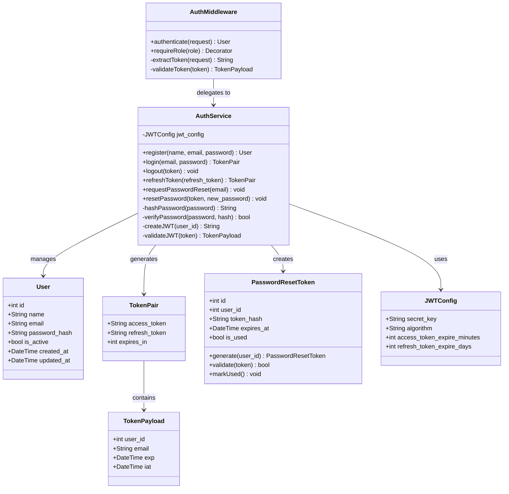
```mermaid
classDiagram
    class User {
        +int id
        +String name
        +String email
        +String password_hash
        +bool is_active
        +DateTime created_at
        +DateTime updated_at
    }

    class AuthService {
        -JWTConfig jwt_config
        +register(name, email, password) User
        +login(email, password) TokenPair
        +logout(token) void
        +refreshToken(refresh_token) TokenPair
        +requestPasswordReset(email) void
        +resetPassword(token, new_password) void
        -hashPassword(password) String
        -verifyPassword(password, hash) bool
        -createJWT(user_id) String
        -validateJWT(token) TokenPayload
    }

    class TokenPair {
        +String access_token
        +String refresh_token
        +int expires_in
    }

    class TokenPayload {
        +int user_id
        +String email
        +DateTime exp
        +DateTime iat
    }

    class PasswordResetToken {
        +int id
        +int user_id
        +String token_hash
        +DateTime expires_at
        +bool is_used
        +generate(user_id) PasswordResetToken
        +validate(token) bool
        +markUsed() void
    }

    class JWTConfig {
        +String secret_key
        +String algorithm
        +int access_token_expire_minutes
        +int refresh_token_expire_days
    }

    class AuthMiddleware {
        +authenticate(request) User
        +requireRole(role) Decorator
        -extractToken(request) String
        -validateToken(token) TokenPayload
    }

    AuthService --> User : manages
    AuthService --> TokenPair : generates
    AuthService --> PasswordResetToken : creates
    AuthService --> JWTConfig : uses
    AuthMiddleware --> AuthService : delegates to
    TokenPair --> TokenPayload : contains
```

_Figure 5: Class Diagram -- User Authentication Module_

### 3.3 Project Management Module

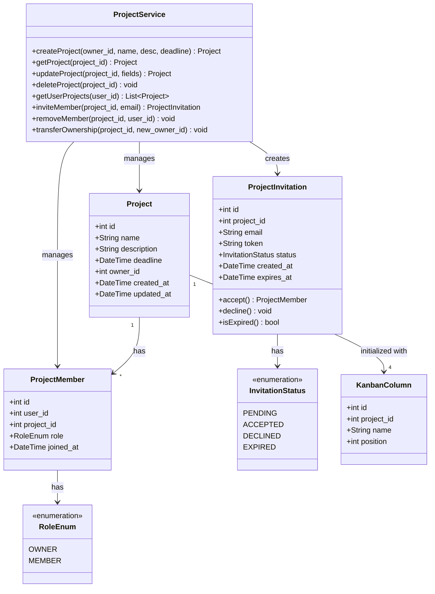
```mermaid
classDiagram
    class ProjectService {
        +createProject(owner_id, name, desc, deadline) Project
        +getProject(project_id) Project
        +updateProject(project_id, fields) Project
        +deleteProject(project_id) void
        +getUserProjects(user_id) List~Project~
        +inviteMember(project_id, email) ProjectInvitation
        +removeMember(project_id, user_id) void
        +transferOwnership(project_id, new_owner_id) void
    }

    class Project {
        +int id
        +String name
        +String description
        +DateTime deadline
        +int owner_id
        +DateTime created_at
        +DateTime updated_at
    }

    class ProjectMember {
        +int id
        +int user_id
        +int project_id
        +RoleEnum role
        +DateTime joined_at
    }

    class ProjectInvitation {
        +int id
        +int project_id
        +String email
        +String token
        +InvitationStatus status
        +DateTime created_at
        +DateTime expires_at
        +accept() ProjectMember
        +decline() void
        +isExpired() bool
    }

    class InvitationStatus {
        <<enumeration>>
        PENDING
        ACCEPTED
        DECLINED
        EXPIRED
    }

    class RoleEnum {
        <<enumeration>>
        OWNER
        MEMBER
    }

    class KanbanColumn {
        +int id
        +int project_id
        +String name
        +int position
    }

    ProjectService --> Project : manages
    ProjectService --> ProjectMember : manages
    ProjectService --> ProjectInvitation : creates
    Project "1" --> "*" ProjectMember : has
    Project "1" --> "4" KanbanColumn : initialized with
    ProjectMember --> RoleEnum : has
    ProjectInvitation --> InvitationStatus : has
```

_Figure 6: Class Diagram -- Project Management Module_

### 3.4 Kanban Board Module

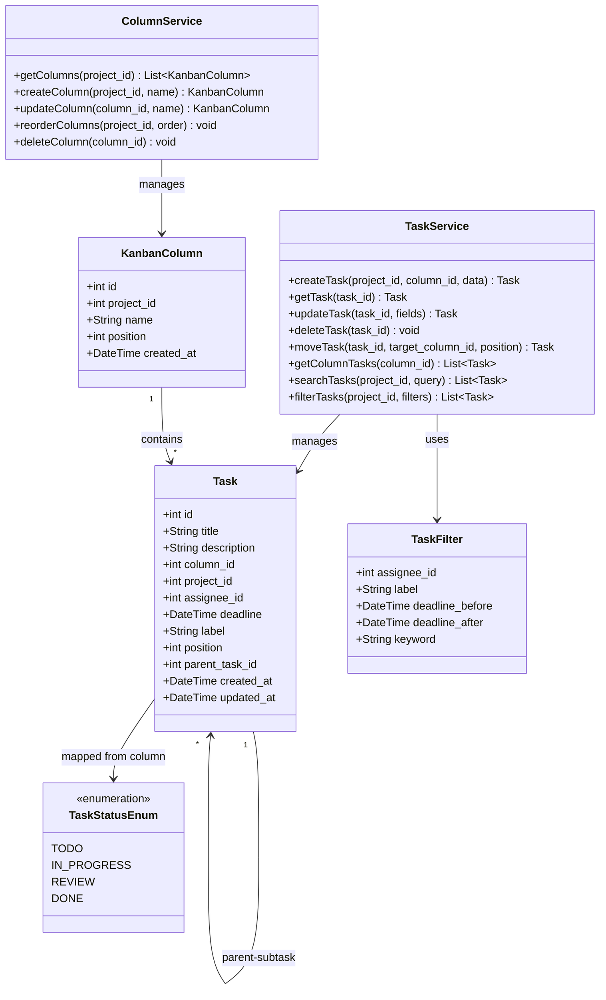
```mermaid
classDiagram
    class TaskService {
        +createTask(project_id, column_id, data) Task
        +getTask(task_id) Task
        +updateTask(task_id, fields) Task
        +deleteTask(task_id) void
        +moveTask(task_id, target_column_id, position) Task
        +getColumnTasks(column_id) List~Task~
        +searchTasks(project_id, query) List~Task~
        +filterTasks(project_id, filters) List~Task~
    }

    class ColumnService {
        +getColumns(project_id) List~KanbanColumn~
        +createColumn(project_id, name) KanbanColumn
        +updateColumn(column_id, name) KanbanColumn
        +reorderColumns(project_id, order) void
        +deleteColumn(column_id) void
    }

    class KanbanColumn {
        +int id
        +int project_id
        +String name
        +int position
        +DateTime created_at
    }

    class Task {
        +int id
        +String title
        +String description
        +int column_id
        +int project_id
        +int assignee_id
        +DateTime deadline
        +String label
        +int position
        +int parent_task_id
        +DateTime created_at
        +DateTime updated_at
    }

    class TaskFilter {
        +int assignee_id
        +String label
        +DateTime deadline_before
        +DateTime deadline_after
        +String keyword
    }

    class TaskStatusEnum {
        <<enumeration>>
        TODO
        IN_PROGRESS
        REVIEW
        DONE
    }

    TaskService --> Task : manages
    TaskService --> TaskFilter : uses
    ColumnService --> KanbanColumn : manages
    KanbanColumn "1" --> "*" Task : contains
    Task --> TaskStatusEnum : mapped from column
    Task "1" --> "*" Task : parent-subtask
```

_Figure 7: Class Diagram -- Kanban Board Module_

### 3.5 AI Task Decomposition Module

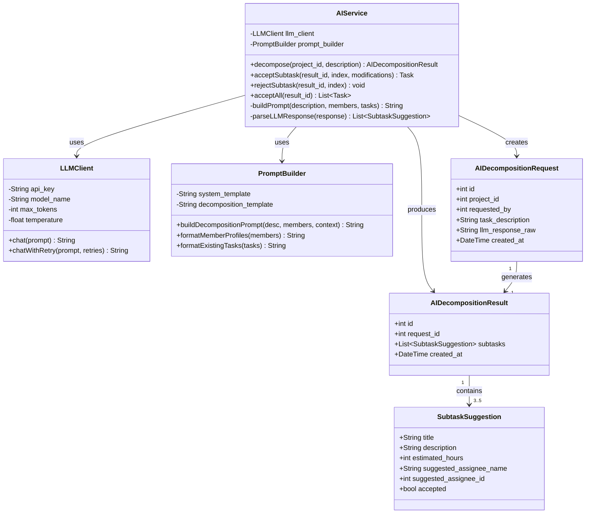
```mermaid
classDiagram
    class AIService {
        -LLMClient llm_client
        -PromptBuilder prompt_builder
        +decompose(project_id, description) AIDecompositionResult
        +acceptSubtask(result_id, index, modifications) Task
        +rejectSubtask(result_id, index) void
        +acceptAll(result_id) List~Task~
        -buildPrompt(description, members, tasks) String
        -parseLLMResponse(response) List~SubtaskSuggestion~
    }

    class LLMClient {
        -String api_key
        -String model_name
        -int max_tokens
        -float temperature
        +chat(prompt) String
        +chatWithRetry(prompt, retries) String
    }

    class PromptBuilder {
        -String system_template
        -String decomposition_template
        +buildDecompositionPrompt(desc, members, context) String
        +formatMemberProfiles(members) String
        +formatExistingTasks(tasks) String
    }

    class AIDecompositionRequest {
        +int id
        +int project_id
        +int requested_by
        +String task_description
        +String llm_response_raw
        +DateTime created_at
    }

    class AIDecompositionResult {
        +int id
        +int request_id
        +List~SubtaskSuggestion~ subtasks
        +DateTime created_at
    }

    class SubtaskSuggestion {
        +String title
        +String description
        +int estimated_hours
        +String suggested_assignee_name
        +int suggested_assignee_id
        +bool accepted
    }

    AIService --> LLMClient : uses
    AIService --> PromptBuilder : uses
    AIService --> AIDecompositionRequest : creates
    AIService --> AIDecompositionResult : produces
    AIDecompositionResult "1" --> "3..5" SubtaskSuggestion : contains
    AIDecompositionRequest "1" --> "1" AIDecompositionResult : generates
```

_Figure 8: Class Diagram -- AI Task Decomposition Module_

### 3.6 Notification System Module

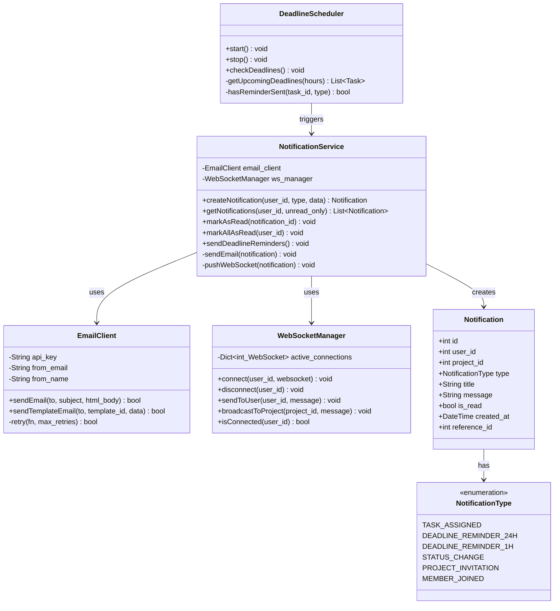
```mermaid
classDiagram
    class NotificationService {
        -EmailClient email_client
        -WebSocketManager ws_manager
        +createNotification(user_id, type, data) Notification
        +getNotifications(user_id, unread_only) List~Notification~
        +markAsRead(notification_id) void
        +markAllAsRead(user_id) void
        +sendDeadlineReminders() void
        -sendEmail(notification) void
        -pushWebSocket(notification) void
    }

    class EmailClient {
        -String api_key
        -String from_email
        -String from_name
        +sendEmail(to, subject, html_body) bool
        +sendTemplateEmail(to, template_id, data) bool
        -retry(fn, max_retries) bool
    }

    class WebSocketManager {
        -Dict~int_WebSocket~ active_connections
        +connect(user_id, websocket) void
        +disconnect(user_id) void
        +sendToUser(user_id, message) void
        +broadcastToProject(project_id, message) void
        +isConnected(user_id) bool
    }

    class Notification {
        +int id
        +int user_id
        +int project_id
        +NotificationType type
        +String title
        +String message
        +bool is_read
        +DateTime created_at
        +int reference_id
    }

    class NotificationType {
        <<enumeration>>
        TASK_ASSIGNED
        DEADLINE_REMINDER_24H
        DEADLINE_REMINDER_1H
        STATUS_CHANGE
        PROJECT_INVITATION
        MEMBER_JOINED
    }

    class DeadlineScheduler {
        +start() void
        +stop() void
        +checkDeadlines() void
        -getUpcomingDeadlines(hours) List~Task~
        -hasReminderSent(task_id, type) bool
    }

    NotificationService --> EmailClient : uses
    NotificationService --> WebSocketManager : uses
    NotificationService --> Notification : creates
    Notification --> NotificationType : has
    DeadlineScheduler --> NotificationService : triggers
```

_Figure 9: Class Diagram -- Notification System Module_

### 3.7 Data Analytics Module

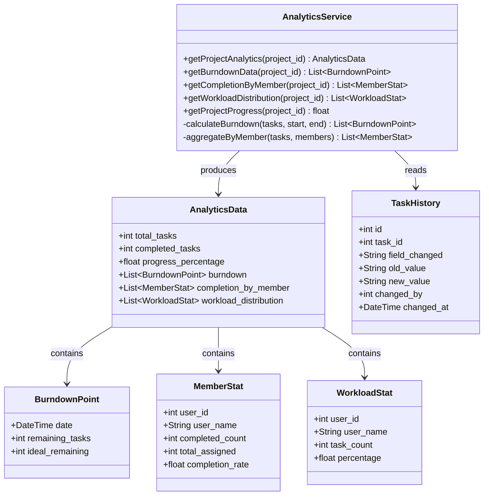
```mermaid
classDiagram
    class AnalyticsService {
        +getProjectAnalytics(project_id) AnalyticsData
        +getBurndownData(project_id) List~BurndownPoint~
        +getCompletionByMember(project_id) List~MemberStat~
        +getWorkloadDistribution(project_id) List~WorkloadStat~
        +getProjectProgress(project_id) float
        -calculateBurndown(tasks, start, end) List~BurndownPoint~
        -aggregateByMember(tasks, members) List~MemberStat~
    }

    class AnalyticsData {
        +int total_tasks
        +int completed_tasks
        +float progress_percentage
        +List~BurndownPoint~ burndown
        +List~MemberStat~ completion_by_member
        +List~WorkloadStat~ workload_distribution
    }

    class BurndownPoint {
        +DateTime date
        +int remaining_tasks
        +int ideal_remaining
    }

    class MemberStat {
        +int user_id
        +String user_name
        +int completed_count
        +int total_assigned
        +float completion_rate
    }

    class WorkloadStat {
        +int user_id
        +String user_name
        +int task_count
        +float percentage
    }

    class TaskHistory {
        +int id
        +int task_id
        +String field_changed
        +String old_value
        +String new_value
        +int changed_by
        +DateTime changed_at
    }

    AnalyticsService --> AnalyticsData : produces
    AnalyticsData --> BurndownPoint : contains
    AnalyticsData --> MemberStat : contains
    AnalyticsData --> WorkloadStat : contains
    AnalyticsService --> TaskHistory : reads
```

_Figure 10: Class Diagram -- Data Analytics Module_

### 3.8 Frontend Component Class Diagram

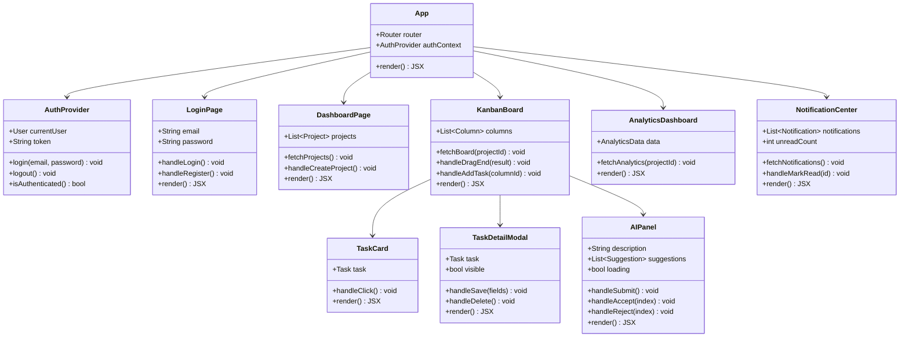
```mermaid
classDiagram
    class App {
        +Router router
        +AuthProvider authContext
        +render() JSX
    }

    class AuthProvider {
        +User currentUser
        +String token
        +login(email, password) void
        +logout() void
        +isAuthenticated() bool
    }

    class LoginPage {
        +String email
        +String password
        +handleLogin() void
        +handleRegister() void
        +render() JSX
    }

    class DashboardPage {
        +List~Project~ projects
        +fetchProjects() void
        +handleCreateProject() void
        +render() JSX
    }

    class KanbanBoard {
        +List~Column~ columns
        +fetchBoard(projectId) void
        +handleDragEnd(result) void
        +handleAddTask(columnId) void
        +render() JSX
    }

    class TaskCard {
        +Task task
        +handleClick() void
        +render() JSX
    }

    class TaskDetailModal {
        +Task task
        +bool visible
        +handleSave(fields) void
        +handleDelete() void
        +render() JSX
    }

    class AIPanel {
        +String description
        +List~Suggestion~ suggestions
        +bool loading
        +handleSubmit() void
        +handleAccept(index) void
        +handleReject(index) void
        +render() JSX
    }

    class AnalyticsDashboard {
        +AnalyticsData data
        +fetchAnalytics(projectId) void
        +render() JSX
    }

    class NotificationCenter {
        +List~Notification~ notifications
        +int unreadCount
        +fetchNotifications() void
        +handleMarkRead(id) void
        +render() JSX
    }

    App --> AuthProvider
    App --> LoginPage
    App --> DashboardPage
    App --> KanbanBoard
    App --> AnalyticsDashboard
    App --> NotificationCenter
    KanbanBoard --> TaskCard
    KanbanBoard --> TaskDetailModal
    KanbanBoard --> AIPanel
```

_Figure 11: Frontend Component Class Diagram_

---

## 4. Complete Sequence Diagrams

### 4.1 User Registration

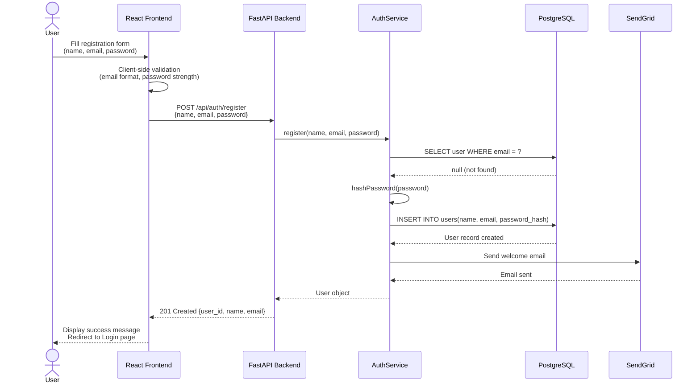
```mermaid
sequenceDiagram
    actor U as User
    participant FE as React Frontend
    participant API as FastAPI Backend
    participant AS as AuthService
    participant DB as PostgreSQL
    participant EM as SendGrid

    U->>FE: Fill registration form<br/>(name, email, password)
    FE->>FE: Client-side validation<br/>(email format, password strength)
    FE->>API: POST /api/auth/register<br/>{name, email, password}
    API->>AS: register(name, email, password)
    AS->>DB: SELECT user WHERE email = ?
    DB-->>AS: null (not found)
    AS->>AS: hashPassword(password)
    AS->>DB: INSERT INTO users(name, email, password_hash)
    DB-->>AS: User record created
    AS->>EM: Send welcome email
    EM-->>AS: Email sent
    AS-->>API: User object
    API-->>FE: 201 Created {user_id, name, email}
    FE-->>U: Display success message<br/>Redirect to Login page
```

_Figure 12: Sequence Diagram -- User Registration_

### 4.2 User Login

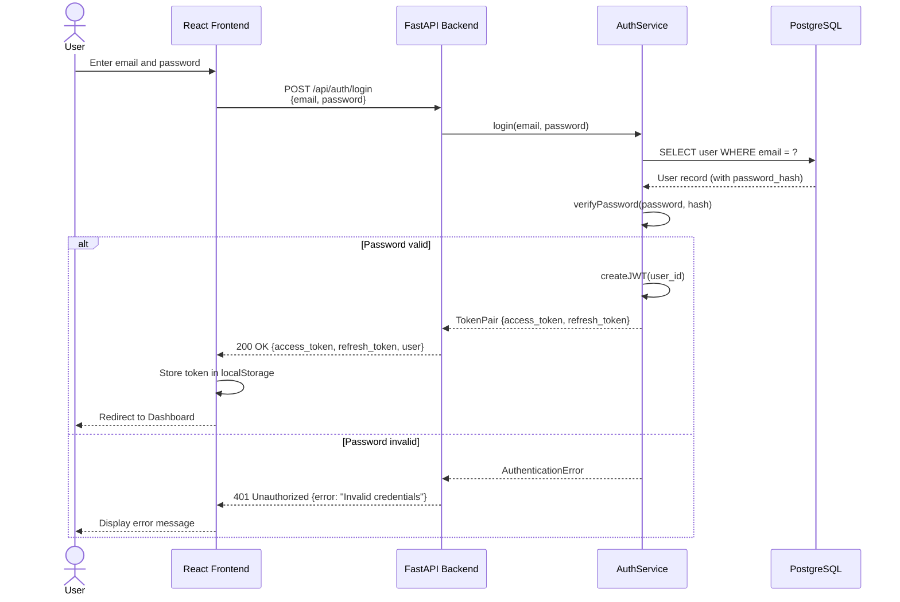
```mermaid
sequenceDiagram
    actor U as User
    participant FE as React Frontend
    participant API as FastAPI Backend
    participant AS as AuthService
    participant DB as PostgreSQL

    U->>FE: Enter email and password
    FE->>API: POST /api/auth/login<br/>{email, password}
    API->>AS: login(email, password)
    AS->>DB: SELECT user WHERE email = ?
    DB-->>AS: User record (with password_hash)
    AS->>AS: verifyPassword(password, hash)
    alt Password valid
        AS->>AS: createJWT(user_id)
        AS-->>API: TokenPair {access_token, refresh_token}
        API-->>FE: 200 OK {access_token, refresh_token, user}
        FE->>FE: Store token in localStorage
        FE-->>U: Redirect to Dashboard
    else Password invalid
        AS-->>API: AuthenticationError
        API-->>FE: 401 Unauthorized {error: "Invalid credentials"}
        FE-->>U: Display error message
    end
```

_Figure 13: Sequence Diagram -- User Login_

### 4.3 Create Project

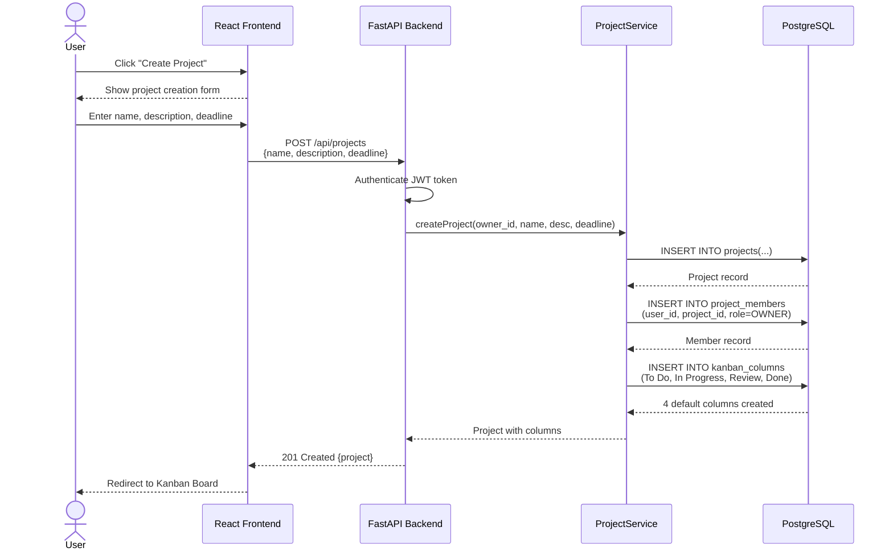
```mermaid
sequenceDiagram
    actor U as User
    participant FE as React Frontend
    participant API as FastAPI Backend
    participant PS as ProjectService
    participant DB as PostgreSQL

    U->>FE: Click "Create Project"
    FE-->>U: Show project creation form
    U->>FE: Enter name, description, deadline
    FE->>API: POST /api/projects<br/>{name, description, deadline}
    API->>API: Authenticate JWT token
    API->>PS: createProject(owner_id, name, desc, deadline)
    PS->>DB: INSERT INTO projects(...)
    DB-->>PS: Project record
    PS->>DB: INSERT INTO project_members<br/>(user_id, project_id, role=OWNER)
    DB-->>PS: Member record
    PS->>DB: INSERT INTO kanban_columns<br/>(To Do, In Progress, Review, Done)
    DB-->>PS: 4 default columns created
    PS-->>API: Project with columns
    API-->>FE: 201 Created {project}
    FE-->>U: Redirect to Kanban Board
```

_Figure 14: Sequence Diagram -- Create Project_

### 4.4 Invite Team Members

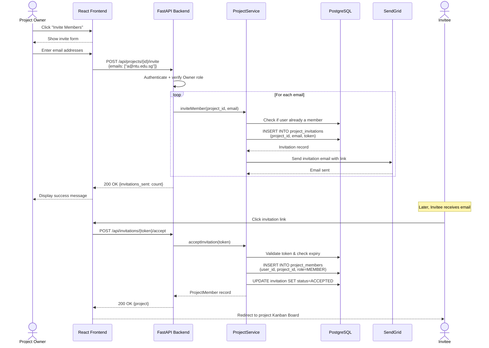
```mermaid
sequenceDiagram
    actor Owner as Project Owner
    participant FE as React Frontend
    participant API as FastAPI Backend
    participant PS as ProjectService
    participant DB as PostgreSQL
    participant EM as SendGrid
    actor Invitee as Invitee

    Owner->>FE: Click "Invite Members"
    FE-->>Owner: Show invite form
    Owner->>FE: Enter email addresses
    FE->>API: POST /api/projects/{id}/invite<br/>{emails: ["a@ntu.edu.sg"]}
    API->>API: Authenticate + verify Owner role
    loop For each email
        API->>PS: inviteMember(project_id, email)
        PS->>DB: Check if user already a member
        PS->>DB: INSERT INTO project_invitations<br/>(project_id, email, token)
        DB-->>PS: Invitation record
        PS->>EM: Send invitation email with link
        EM-->>PS: Email sent
    end
    API-->>FE: 200 OK {invitations_sent: count}
    FE-->>Owner: Display success message

    Note over Invitee: Later, Invitee receives email
    Invitee->>FE: Click invitation link
    FE->>API: POST /api/invitations/{token}/accept
    API->>PS: acceptInvitation(token)
    PS->>DB: Validate token & check expiry
    PS->>DB: INSERT INTO project_members<br/>(user_id, project_id, role=MEMBER)
    PS->>DB: UPDATE invitation SET status=ACCEPTED
    PS-->>API: ProjectMember record
    API-->>FE: 200 OK {project}
    FE-->>Invitee: Redirect to project Kanban Board
```

_Figure 15: Sequence Diagram -- Invite Team Members_

### 4.5 Create Task

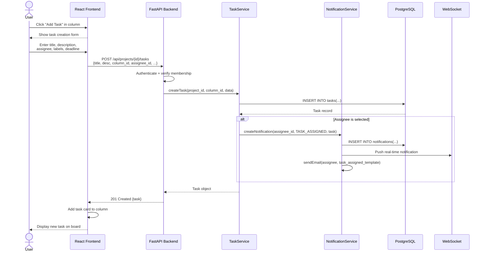
```mermaid
sequenceDiagram
    actor U as User
    participant FE as React Frontend
    participant API as FastAPI Backend
    participant TS as TaskService
    participant NS as NotificationService
    participant DB as PostgreSQL
    participant WS as WebSocket

    U->>FE: Click "Add Task" in column
    FE-->>U: Show task creation form
    U->>FE: Enter title, description,<br/>assignee, labels, deadline
    FE->>API: POST /api/projects/{id}/tasks<br/>{title, desc, column_id, assignee_id, ...}
    API->>API: Authenticate + verify membership
    API->>TS: createTask(project_id, column_id, data)
    TS->>DB: INSERT INTO tasks(...)
    DB-->>TS: Task record
    alt Assignee is selected
        TS->>NS: createNotification(assignee_id, TASK_ASSIGNED, task)
        NS->>DB: INSERT INTO notifications(...)
        NS->>WS: Push real-time notification
        NS->>NS: sendEmail(assignee, task_assigned_template)
    end
    TS-->>API: Task object
    API-->>FE: 201 Created {task}
    FE->>FE: Add task card to column
    FE-->>U: Display new task on board
```

_Figure 16: Sequence Diagram -- Create Task_

### 4.6 Move Task (Drag-and-Drop)

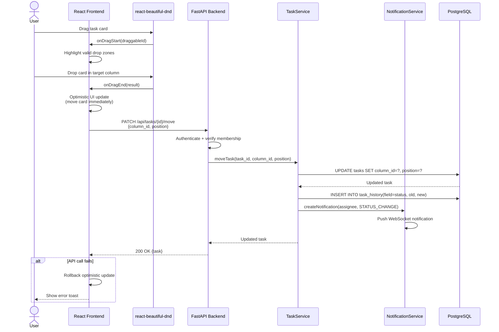
```mermaid
sequenceDiagram
    actor U as User
    participant FE as React Frontend
    participant DnD as react-beautiful-dnd
    participant API as FastAPI Backend
    participant TS as TaskService
    participant NS as NotificationService
    participant DB as PostgreSQL

    U->>DnD: Drag task card
    DnD->>FE: onDragStart(draggableId)
    FE->>FE: Highlight valid drop zones
    U->>DnD: Drop card in target column
    DnD->>FE: onDragEnd(result)
    FE->>FE: Optimistic UI update<br/>(move card immediately)
    FE->>API: PATCH /api/tasks/{id}/move<br/>{column_id, position}
    API->>API: Authenticate + verify membership
    API->>TS: moveTask(task_id, column_id, position)
    TS->>DB: UPDATE tasks SET column_id=?, position=?
    DB-->>TS: Updated task
    TS->>DB: INSERT INTO task_history(field=status, old, new)
    TS->>NS: createNotification(assignee, STATUS_CHANGE)
    NS->>NS: Push WebSocket notification
    TS-->>API: Updated task
    API-->>FE: 200 OK {task}
    alt API call fails
        FE->>FE: Rollback optimistic update
        FE-->>U: Show error toast
    end
```

_Figure 17: Sequence Diagram -- Move Task (Drag-and-Drop)_

### 4.7 AI Task Decomposition

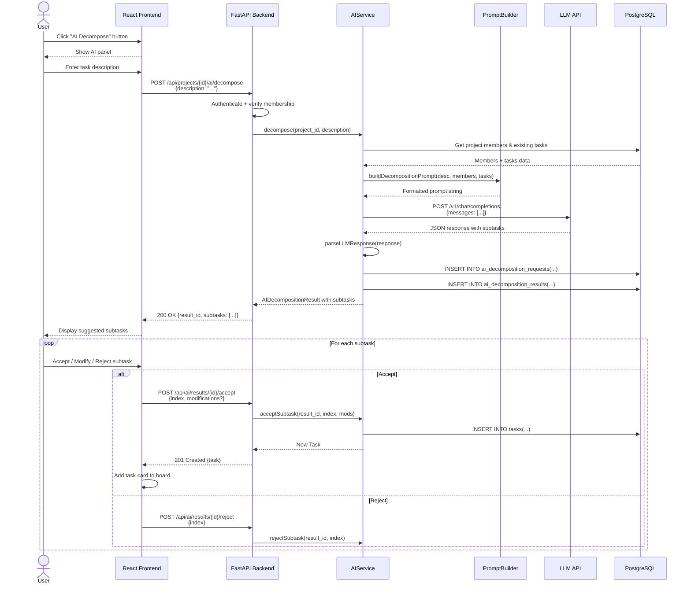
```mermaid
sequenceDiagram
    actor U as User
    participant FE as React Frontend
    participant API as FastAPI Backend
    participant AIS as AIService
    participant PB as PromptBuilder
    participant LLM as LLM API
    participant DB as PostgreSQL

    U->>FE: Click "AI Decompose" button
    FE-->>U: Show AI panel
    U->>FE: Enter task description
    FE->>API: POST /api/projects/{id}/ai/decompose<br/>{description: "..."}
    API->>API: Authenticate + verify membership
    API->>AIS: decompose(project_id, description)
    AIS->>DB: Get project members & existing tasks
    DB-->>AIS: Members + tasks data
    AIS->>PB: buildDecompositionPrompt(desc, members, tasks)
    PB-->>AIS: Formatted prompt string
    AIS->>LLM: POST /v1/chat/completions<br/>{messages: [...]}
    LLM-->>AIS: JSON response with subtasks
    AIS->>AIS: parseLLMResponse(response)
    AIS->>DB: INSERT INTO ai_decomposition_requests(...)
    AIS->>DB: INSERT INTO ai_decomposition_results(...)
    AIS-->>API: AIDecompositionResult with subtasks
    API-->>FE: 200 OK {result_id, subtasks: [...]}
    FE-->>U: Display suggested subtasks

    loop For each subtask
        U->>FE: Accept / Modify / Reject subtask
        alt Accept
            FE->>API: POST /api/ai/results/{id}/accept<br/>{index, modifications?}
            API->>AIS: acceptSubtask(result_id, index, mods)
            AIS->>DB: INSERT INTO tasks(...)
            AIS-->>API: New Task
            API-->>FE: 201 Created {task}
            FE->>FE: Add task card to board
        else Reject
            FE->>API: POST /api/ai/results/{id}/reject<br/>{index}
            API->>AIS: rejectSubtask(result_id, index)
        end
    end
```

_Figure 18: Sequence Diagram -- AI Task Decomposition_

### 4.8 Deadline Reminder Notification

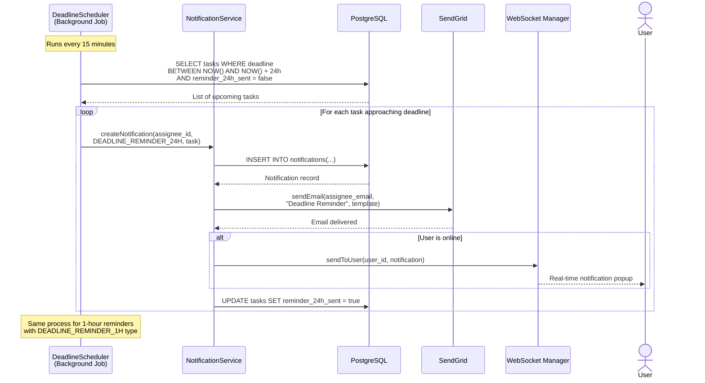
```mermaid
sequenceDiagram
    participant CRON as DeadlineScheduler<br/>(Background Job)
    participant NS as NotificationService
    participant DB as PostgreSQL
    participant EM as SendGrid
    participant WS as WebSocket Manager
    actor U as User

    Note over CRON: Runs every 15 minutes
    CRON->>DB: SELECT tasks WHERE deadline<br/>BETWEEN NOW() AND NOW() + 24h<br/>AND reminder_24h_sent = false
    DB-->>CRON: List of upcoming tasks

    loop For each task approaching deadline
        CRON->>NS: createNotification(assignee_id,<br/>DEADLINE_REMINDER_24H, task)
        NS->>DB: INSERT INTO notifications(...)
        DB-->>NS: Notification record

        NS->>EM: sendEmail(assignee_email,<br/>"Deadline Reminder", template)
        EM-->>NS: Email delivered

        alt User is online
            NS->>WS: sendToUser(user_id, notification)
            WS-->>U: Real-time notification popup
        end

        NS->>DB: UPDATE tasks SET reminder_24h_sent = true
    end

    Note over CRON: Same process for 1-hour reminders<br/>with DEADLINE_REMINDER_1H type
```

_Figure 19: Sequence Diagram -- Deadline Reminder Notification_

### 4.9 View Analytics Dashboard

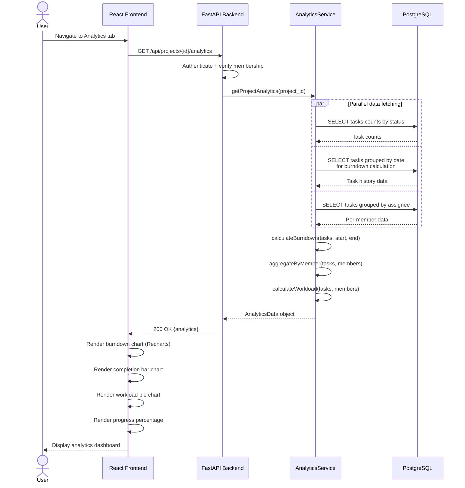
```mermaid
sequenceDiagram
    actor U as User
    participant FE as React Frontend
    participant API as FastAPI Backend
    participant AS as AnalyticsService
    participant DB as PostgreSQL

    U->>FE: Navigate to Analytics tab
    FE->>API: GET /api/projects/{id}/analytics
    API->>API: Authenticate + verify membership
    API->>AS: getProjectAnalytics(project_id)

    par Parallel data fetching
        AS->>DB: SELECT tasks counts by status
        DB-->>AS: Task counts
    and
        AS->>DB: SELECT tasks grouped by date<br/>for burndown calculation
        DB-->>AS: Task history data
    and
        AS->>DB: SELECT tasks grouped by assignee
        DB-->>AS: Per-member data
    end

    AS->>AS: calculateBurndown(tasks, start, end)
    AS->>AS: aggregateByMember(tasks, members)
    AS->>AS: calculateWorkload(tasks, members)
    AS-->>API: AnalyticsData object
    API-->>FE: 200 OK {analytics}

    FE->>FE: Render burndown chart (Recharts)
    FE->>FE: Render completion bar chart
    FE->>FE: Render workload pie chart
    FE->>FE: Render progress percentage
    FE-->>U: Display analytics dashboard
```

_Figure 20: Sequence Diagram -- View Analytics Dashboard_

### 4.10 Password Reset

```mermaid
sequenceDiagram
    actor U as User
    participant FE as React Frontend
    participant API as FastAPI Backend
    participant AS as AuthService
    participant DB as PostgreSQL
    participant EM as SendGrid

    U->>FE: Click "Forgot Password?"
    FE-->>U: Show email input form
    U->>FE: Enter registered email
    FE->>API: POST /api/auth/password-reset/request<br/>{email}
    API->>AS: requestPasswordReset(email)
    AS->>DB: SELECT user WHERE email = ?
    alt User found
        AS->>AS: Generate reset token (UUID + hash)
        AS->>DB: INSERT INTO password_reset_tokens<br/>(user_id, token_hash, expires_at)
        AS->>EM: Send reset email with link
        EM-->>AS: Email sent
    end
    Note over AS: Always return success<br/>(prevent email enumeration)
    AS-->>API: Success
    API-->>FE: 200 OK {message: "If registered, email sent"}
    FE-->>U: Display generic success message

    Note over U: User receives email and clicks link
    U->>FE: Open reset link in browser
    FE-->>U: Show new password form
    U->>FE: Enter new password (twice)
    FE->>API: POST /api/auth/password-reset/confirm<br/>{token, new_password}
    API->>AS: resetPassword(token, new_password)
    AS->>DB: SELECT token WHERE hash = ? AND expires > NOW()
    alt Token valid
        AS->>AS: hashPassword(new_password)
        AS->>DB: UPDATE users SET password_hash = ?
        AS->>DB: UPDATE token SET is_used = true
        AS-->>API: Success
        API-->>FE: 200 OK
        FE-->>U: "Password reset successful"<br/>Redirect to Login
    else Token invalid/expired
        AS-->>API: InvalidTokenError
        API-->>FE: 400 Bad Request
        FE-->>U: "Link expired. Request new reset."
    end
```

_Figure 21: Sequence Diagram -- Password Reset_

---

## 5. Complete Dialog Map

### 5.1 Overall Application Navigation Flow

```mermaid
stateDiagram-v2
    [*] --> LoginPage

    LoginPage --> RegisterPage : Click "Sign Up"
    RegisterPage --> LoginPage : Registration successful
    LoginPage --> ForgotPasswordPage : Click "Forgot Password"
    ForgotPasswordPage --> LoginPage : Reset complete
    LoginPage --> Dashboard : Login successful

    state Dashboard {
        [*] --> ProjectList
        ProjectList --> CreateProjectModal : Click "Create Project"
        CreateProjectModal --> ProjectList : Cancel
        CreateProjectModal --> KanbanView : Project created
    }

    Dashboard --> KanbanView : Select project

    state KanbanView {
        [*] --> BoardView
        BoardView --> TaskDetailModal : Click task card
        TaskDetailModal --> BoardView : Close modal
        BoardView --> AIPanel : Click "AI Decompose"
        AIPanel --> BoardView : Close panel
        BoardView --> ProjectSettings : Click Settings
        ProjectSettings --> BoardView : Back
    }

    KanbanView --> AnalyticsDashboard : Click Analytics tab
    AnalyticsDashboard --> KanbanView : Click Board tab

    state NotificationCenter {
        [*] --> NotificationList
        NotificationList --> NotificationDetail : Click notification
    }

    KanbanView --> NotificationCenter : Click bell icon
    AnalyticsDashboard --> NotificationCenter : Click bell icon
    NotificationCenter --> KanbanView : Navigate to task
    NotificationCenter --> Dashboard : Close

    Dashboard --> LoginPage : Logout
    KanbanView --> LoginPage : Logout
    AnalyticsDashboard --> LoginPage : Logout
```

_Figure 22: Dialog Map -- Overall Application Navigation Flow_

### 5.2 Task Lifecycle State Machine

```mermaid
stateDiagram-v2
    [*] --> ToDo : Task created

    ToDo --> InProgress : Drag to "In Progress"
    InProgress --> Review : Drag to "Review"
    Review --> Done : Drag to "Done"

    ToDo --> Review : Drag to "Review"
    ToDo --> Done : Drag to "Done"
    InProgress --> ToDo : Drag back to "To Do"
    InProgress --> Done : Drag to "Done"
    Review --> InProgress : Drag back to "In Progress"
    Review --> ToDo : Drag back to "To Do"
    Done --> Review : Drag back to "Review"
    Done --> InProgress : Reopen task

    ToDo --> [*] : Task deleted
    InProgress --> [*] : Task deleted
    Review --> [*] : Task deleted
    Done --> [*] : Task deleted

    note right of Done : Triggers analytics<br/>recalculation
    note right of ToDo : Default column for<br/>new and AI-generated tasks
```

_Figure 23: State Machine Diagram -- Task Lifecycle_

### 5.3 Authentication Flow Dialog Map

```mermaid
stateDiagram-v2
    [*] --> LoginForm

    state LoginForm {
        [*] --> EnterCredentials
        EnterCredentials --> Validating : Submit
        Validating --> LoginError : Invalid credentials
        LoginError --> EnterCredentials : Retry
        Validating --> AccountLocked : 5 failed attempts
        AccountLocked --> EnterCredentials : After 15 min
        Validating --> Authenticated : Credentials valid
    }

    state RegisterForm {
        [*] --> EnterDetails
        EnterDetails --> ValidatingReg : Submit
        ValidatingReg --> EmailExists : Email taken
        EmailExists --> EnterDetails : Use different email
        ValidatingReg --> WeakPassword : Password too weak
        WeakPassword --> EnterDetails : Fix password
        ValidatingReg --> RegistrationComplete : All valid
    }

    state PasswordResetFlow {
        [*] --> EnterEmail
        EnterEmail --> EmailSent : Submit
        EmailSent --> NewPasswordForm : Click email link
        NewPasswordForm --> ResetComplete : Valid password
        NewPasswordForm --> TokenExpired : Link expired
        TokenExpired --> EnterEmail : Request new link
    }

    LoginForm --> RegisterForm : Click "Sign Up"
    RegisterForm --> LoginForm : Click "Login"
    LoginForm --> PasswordResetFlow : "Forgot Password"
    RegistrationComplete --> LoginForm : Auto-redirect
    ResetComplete --> LoginForm : Auto-redirect
    Authenticated --> [*] : Redirect to Dashboard
```

_Figure 24: Dialog Map -- Authentication Flow_

### 5.4 Project Management Dialog Map

```mermaid
stateDiagram-v2
    [*] --> ProjectList

    state ProjectList {
        [*] --> ViewProjects
        ViewProjects --> CreateForm : "Create Project"
        CreateForm --> ViewProjects : Cancel
        CreateForm --> NewProject : Submit
    }

    NewProject --> KanbanBoard : Auto-navigate

    state KanbanBoard {
        [*] --> ViewBoard
        ViewBoard --> AddTaskForm : "Add Task"
        AddTaskForm --> ViewBoard : Save / Cancel
        ViewBoard --> TaskDetail : Click card
        TaskDetail --> ViewBoard : Close
        TaskDetail --> EditTask : Click Edit
        EditTask --> TaskDetail : Save
        TaskDetail --> DeleteConfirm : Click Delete
        DeleteConfirm --> ViewBoard : Confirm
        DeleteConfirm --> TaskDetail : Cancel
        ViewBoard --> FilterPanel : Click Filter
        FilterPanel --> ViewBoard : Apply / Clear
    }

    state Settings {
        [*] --> ProjectInfo
        ProjectInfo --> EditProjectForm : Edit
        EditProjectForm --> ProjectInfo : Save
        ProjectInfo --> MemberList : Members tab
        MemberList --> InviteForm : Invite
        InviteForm --> MemberList : Send
        MemberList --> RemoveConfirm : Remove member
        ProjectInfo --> DangerZone : Danger Zone
        DangerZone --> DeleteProjectConfirm : Delete Project
        DeleteProjectConfirm --> ProjectList : Confirmed
    }

    KanbanBoard --> Settings : Settings icon
    Settings --> KanbanBoard : Back
```

_Figure 25: Dialog Map -- Project Management Flow_

---

## 6. Database Design

### 6.1 Entity-Relationship Diagram

```mermaid
erDiagram
    USERS {
        int id PK
        varchar name
        varchar email
        varchar password_hash
        boolean is_active
        timestamp created_at
        timestamp updated_at
    }

    PROJECTS {
        int id PK
        varchar name
        text description
        timestamp deadline
        int owner_id FK
        timestamp created_at
        timestamp updated_at
    }

    PROJECT_MEMBERS {
        int id PK
        int user_id FK
        int project_id FK
        varchar role
        timestamp joined_at
    }

    PROJECT_INVITATIONS {
        int id PK
        int project_id FK
        varchar email
        varchar token_hash
        varchar status
        timestamp created_at
        timestamp expires_at
    }

    KANBAN_COLUMNS {
        int id PK
        int project_id FK
        varchar name
        int position
        timestamp created_at
    }

    TASKS {
        int id PK
        varchar title
        text description
        int column_id FK
        int project_id FK
        int assignee_id FK
        timestamp deadline
        varchar label
        int position
        int parent_task_id FK
        boolean reminder_24h_sent
        boolean reminder_1h_sent
        timestamp created_at
        timestamp updated_at
    }

    TASK_HISTORY {
        int id PK
        int task_id FK
        varchar field_changed
        text old_value
        text new_value
        int changed_by FK
        timestamp changed_at
    }

    AI_REQUESTS {
        int id PK
        int project_id FK
        int requested_by FK
        text task_description
        text llm_response_raw
        timestamp created_at
    }

    AI_RESULTS {
        int id PK
        int request_id FK
        json subtasks
        timestamp created_at
    }

    NOTIFICATIONS {
        int id PK
        int user_id FK
        int project_id FK
        varchar type
        varchar title
        text message
        boolean is_read
        int reference_id
        timestamp created_at
    }

    PASSWORD_RESET_TOKENS {
        int id PK
        int user_id FK
        varchar token_hash
        timestamp expires_at
        boolean is_used
    }

    USERS ||--o{ PROJECT_MEMBERS : "belongs to"
    PROJECTS ||--o{ PROJECT_MEMBERS : "has"
    USERS ||--o{ PROJECTS : "owns"
    PROJECTS ||--o{ KANBAN_COLUMNS : "contains"
    PROJECTS ||--o{ TASKS : "has"
    KANBAN_COLUMNS ||--o{ TASKS : "holds"
    USERS ||--o{ TASKS : "assigned to"
    TASKS ||--o{ TASKS : "parent of"
    TASKS ||--o{ TASK_HISTORY : "has history"
    USERS ||--o{ TASK_HISTORY : "changed by"
    PROJECTS ||--o{ PROJECT_INVITATIONS : "has"
    USERS ||--o{ AI_REQUESTS : "requested by"
    PROJECTS ||--o{ AI_REQUESTS : "for project"
    AI_REQUESTS ||--|| AI_RESULTS : "produces"
    USERS ||--o{ NOTIFICATIONS : "receives"
    PROJECTS ||--o{ NOTIFICATIONS : "generates"
    USERS ||--o{ PASSWORD_RESET_TOKENS : "has"
```

_Figure 26: Entity-Relationship Diagram_

### 6.2 Database Schema

```sql
-- Users table
CREATE TABLE users (
    id SERIAL PRIMARY KEY,
    name VARCHAR(100) NOT NULL,
    email VARCHAR(255) UNIQUE NOT NULL,
    password_hash VARCHAR(255) NOT NULL,
    is_active BOOLEAN DEFAULT TRUE,
    created_at TIMESTAMP DEFAULT CURRENT_TIMESTAMP,
    updated_at TIMESTAMP DEFAULT CURRENT_TIMESTAMP
);

-- Projects table
CREATE TABLE projects (
    id SERIAL PRIMARY KEY,
    name VARCHAR(200) NOT NULL,
    description TEXT,
    deadline TIMESTAMP,
    owner_id INTEGER NOT NULL REFERENCES users(id),
    created_at TIMESTAMP DEFAULT CURRENT_TIMESTAMP,
    updated_at TIMESTAMP DEFAULT CURRENT_TIMESTAMP
);

-- Project Members table
CREATE TABLE project_members (
    id SERIAL PRIMARY KEY,
    user_id INTEGER NOT NULL REFERENCES users(id),
    project_id INTEGER NOT NULL REFERENCES projects(id) ON DELETE CASCADE,
    role VARCHAR(20) NOT NULL DEFAULT 'MEMBER',
    joined_at TIMESTAMP DEFAULT CURRENT_TIMESTAMP,
    UNIQUE(user_id, project_id)
);

-- Project Invitations table
CREATE TABLE project_invitations (
    id SERIAL PRIMARY KEY,
    project_id INTEGER NOT NULL REFERENCES projects(id) ON DELETE CASCADE,
    email VARCHAR(255) NOT NULL,
    token_hash VARCHAR(255) UNIQUE NOT NULL,
    status VARCHAR(20) DEFAULT 'PENDING',
    created_at TIMESTAMP DEFAULT CURRENT_TIMESTAMP,
    expires_at TIMESTAMP NOT NULL
);

-- Kanban Columns table
CREATE TABLE kanban_columns (
    id SERIAL PRIMARY KEY,
    project_id INTEGER NOT NULL REFERENCES projects(id) ON DELETE CASCADE,
    name VARCHAR(100) NOT NULL,
    position INTEGER NOT NULL,
    created_at TIMESTAMP DEFAULT CURRENT_TIMESTAMP
);

-- Tasks table
CREATE TABLE tasks (
    id SERIAL PRIMARY KEY,
    title VARCHAR(300) NOT NULL,
    description TEXT,
    column_id INTEGER NOT NULL REFERENCES kanban_columns(id),
    project_id INTEGER NOT NULL REFERENCES projects(id) ON DELETE CASCADE,
    assignee_id INTEGER REFERENCES users(id),
    deadline TIMESTAMP,
    label VARCHAR(50),
    position INTEGER NOT NULL DEFAULT 0,
    parent_task_id INTEGER REFERENCES tasks(id),
    reminder_24h_sent BOOLEAN DEFAULT FALSE,
    reminder_1h_sent BOOLEAN DEFAULT FALSE,
    created_at TIMESTAMP DEFAULT CURRENT_TIMESTAMP,
    updated_at TIMESTAMP DEFAULT CURRENT_TIMESTAMP
);

-- Task History table
CREATE TABLE task_history (
    id SERIAL PRIMARY KEY,
    task_id INTEGER NOT NULL REFERENCES tasks(id) ON DELETE CASCADE,
    field_changed VARCHAR(50) NOT NULL,
    old_value TEXT,
    new_value TEXT,
    changed_by INTEGER REFERENCES users(id),
    changed_at TIMESTAMP DEFAULT CURRENT_TIMESTAMP
);

-- AI Decomposition Requests table
CREATE TABLE ai_requests (
    id SERIAL PRIMARY KEY,
    project_id INTEGER NOT NULL REFERENCES projects(id),
    requested_by INTEGER NOT NULL REFERENCES users(id),
    task_description TEXT NOT NULL,
    llm_response_raw TEXT,
    created_at TIMESTAMP DEFAULT CURRENT_TIMESTAMP
);

-- AI Decomposition Results table
CREATE TABLE ai_results (
    id SERIAL PRIMARY KEY,
    request_id INTEGER NOT NULL REFERENCES ai_requests(id),
    subtasks JSONB NOT NULL,
    created_at TIMESTAMP DEFAULT CURRENT_TIMESTAMP
);

-- Notifications table
CREATE TABLE notifications (
    id SERIAL PRIMARY KEY,
    user_id INTEGER NOT NULL REFERENCES users(id),
    project_id INTEGER REFERENCES projects(id),
    type VARCHAR(30) NOT NULL,
    title VARCHAR(200) NOT NULL,
    message TEXT,
    is_read BOOLEAN DEFAULT FALSE,
    reference_id INTEGER,
    created_at TIMESTAMP DEFAULT CURRENT_TIMESTAMP
);

-- Password Reset Tokens table
CREATE TABLE password_reset_tokens (
    id SERIAL PRIMARY KEY,
    user_id INTEGER NOT NULL REFERENCES users(id),
    token_hash VARCHAR(255) NOT NULL,
    expires_at TIMESTAMP NOT NULL,
    is_used BOOLEAN DEFAULT FALSE
);

-- Indexes
CREATE INDEX idx_tasks_project_id ON tasks(project_id);
CREATE INDEX idx_tasks_column_id ON tasks(column_id);
CREATE INDEX idx_tasks_assignee_id ON tasks(assignee_id);
CREATE INDEX idx_tasks_deadline ON tasks(deadline);
CREATE INDEX idx_notifications_user_id ON notifications(user_id);
CREATE INDEX idx_notifications_is_read ON notifications(user_id, is_read);
CREATE INDEX idx_project_members_user ON project_members(user_id);
CREATE INDEX idx_project_members_project ON project_members(project_id);
```

---

## 7. API Design

### 7.1 RESTful API Endpoints

#### Authentication Endpoints

| Method | Endpoint                           | Description                  | Auth Required |
| ------ | ---------------------------------- | ---------------------------- | ------------- |
| POST   | `/api/auth/register`               | Register new user            | No            |
| POST   | `/api/auth/login`                  | Login and get JWT token      | No            |
| POST   | `/api/auth/logout`                 | Invalidate token             | Yes           |
| POST   | `/api/auth/refresh`                | Refresh access token         | Yes           |
| POST   | `/api/auth/password-reset/request` | Request password reset email | No            |
| POST   | `/api/auth/password-reset/confirm` | Reset password with token    | No            |
| GET    | `/api/auth/me`                     | Get current user profile     | Yes           |

#### Project Endpoints

| Method | Endpoint                           | Description          | Auth Required |
| ------ | ---------------------------------- | -------------------- | ------------- |
| GET    | `/api/projects`                    | List user's projects | Yes           |
| POST   | `/api/projects`                    | Create new project   | Yes           |
| GET    | `/api/projects/{id}`               | Get project details  | Yes (Member)  |
| PUT    | `/api/projects/{id}`               | Update project       | Yes (Owner)   |
| DELETE | `/api/projects/{id}`               | Delete project       | Yes (Owner)   |
| POST   | `/api/projects/{id}/invite`        | Invite members       | Yes (Owner)   |
| DELETE | `/api/projects/{id}/members/{uid}` | Remove member        | Yes (Owner)   |
| POST   | `/api/invitations/{token}/accept`  | Accept invitation    | Yes           |

#### Task Endpoints

| Method | Endpoint                     | Description             | Auth Required |
| ------ | ---------------------------- | ----------------------- | ------------- |
| GET    | `/api/projects/{id}/board`   | Get full Kanban board   | Yes (Member)  |
| GET    | `/api/projects/{id}/tasks`   | List tasks with filters | Yes (Member)  |
| POST   | `/api/projects/{id}/tasks`   | Create new task         | Yes (Member)  |
| GET    | `/api/tasks/{id}`            | Get task details        | Yes (Member)  |
| PUT    | `/api/tasks/{id}`            | Update task             | Yes (Member)  |
| DELETE | `/api/tasks/{id}`            | Delete task             | Yes (Member)  |
| PATCH  | `/api/tasks/{id}/move`       | Move task to column     | Yes (Member)  |
| GET    | `/api/projects/{id}/columns` | List Kanban columns     | Yes (Member)  |
| PUT    | `/api/columns/{id}`          | Update column name      | Yes (Owner)   |

#### AI Endpoints

| Method | Endpoint                          | Description                      | Auth Required |
| ------ | --------------------------------- | -------------------------------- | ------------- |
| POST   | `/api/projects/{id}/ai/decompose` | Submit task for AI decomposition | Yes (Member)  |
| POST   | `/api/ai/results/{id}/accept`     | Accept a subtask suggestion      | Yes (Member)  |
| POST   | `/api/ai/results/{id}/reject`     | Reject a subtask suggestion      | Yes (Member)  |

#### Notification Endpoints

| Method | Endpoint                          | Description        | Auth Required |
| ------ | --------------------------------- | ------------------ | ------------- |
| GET    | `/api/notifications`              | List notifications | Yes           |
| PATCH  | `/api/notifications/{id}/read`    | Mark as read       | Yes           |
| PATCH  | `/api/notifications/read-all`     | Mark all as read   | Yes           |
| GET    | `/api/notifications/unread-count` | Get unread count   | Yes           |

#### Analytics Endpoints

| Method | Endpoint                                | Description             | Auth Required |
| ------ | --------------------------------------- | ----------------------- | ------------- |
| GET    | `/api/projects/{id}/analytics`          | Get full analytics data | Yes (Member)  |
| GET    | `/api/projects/{id}/analytics/burndown` | Get burndown chart data | Yes (Member)  |

### 7.2 WebSocket Events

| Event Name      | Direction        | Payload                                  |
| --------------- | ---------------- | ---------------------------------------- |
| `connect`       | Client -> Server | `{token: "JWT..."}`                      |
| `notification`  | Server -> Client | `{id, type, title, message, created_at}` |
| `task_updated`  | Server -> Client | `{task_id, field, old_value, new_value}` |
| `task_moved`    | Server -> Client | `{task_id, from_column, to_column}`      |
| `member_joined` | Server -> Client | `{project_id, user_id, user_name}`       |

---

## 8. Application Skeleton

### 8.1 Project Structure

```
taskflow/
├── backend/
│   ├── app/
│   │   ├── __init__.py
│   │   ├── main.py                 # FastAPI application entry point
│   │   ├── config.py               # Configuration settings
│   │   ├── database.py             # Database connection setup
│   │   ├── models/                 # SQLAlchemy ORM models
│   │   │   ├── __init__.py
│   │   │   ├── user.py
│   │   │   ├── project.py
│   │   │   ├── task.py
│   │   │   ├── notification.py
│   │   │   └── ai_request.py
│   │   ├── schemas/                # Pydantic request/response schemas
│   │   │   ├── __init__.py
│   │   │   ├── auth.py
│   │   │   ├── project.py
│   │   │   ├── task.py
│   │   │   ├── notification.py
│   │   │   └── analytics.py
│   │   ├── routers/                # API route handlers
│   │   │   ├── __init__.py
│   │   │   ├── auth.py
│   │   │   ├── projects.py
│   │   │   ├── tasks.py
│   │   │   ├── ai.py
│   │   │   ├── notifications.py
│   │   │   └── analytics.py
│   │   ├── services/               # Business logic layer
│   │   │   ├── __init__.py
│   │   │   ├── auth_service.py
│   │   │   ├── project_service.py
│   │   │   ├── task_service.py
│   │   │   ├── ai_service.py
│   │   │   ├── notification_service.py
│   │   │   └── analytics_service.py
│   │   ├── core/                   # Core utilities
│   │   │   ├── __init__.py
│   │   │   ├── security.py         # JWT + password hashing
│   │   │   ├── dependencies.py     # FastAPI dependencies
│   │   │   └── websocket.py        # WebSocket manager
│   │   └── external/               # External service clients
│   │       ├── __init__.py
│   │       ├── llm_client.py
│   │       └── email_client.py
│   ├── alembic/                    # Database migrations
│   │   └── versions/
│   ├── tests/                      # Test suite
│   ├── alembic.ini
│   ├── requirements.txt
│   └── Dockerfile
├── frontend/
│   ├── public/
│   │   └── index.html
│   ├── src/
│   │   ├── index.tsx               # Application entry point
│   │   ├── App.tsx                 # Root component with routing
│   │   ├── api/                    # API client layer
│   │   ├── components/             # Reusable UI components
│   │   │   ├── Layout/
│   │   │   ├── Kanban/
│   │   │   ├── Task/
│   │   │   ├── AI/
│   │   │   ├── Analytics/
│   │   │   └── Notification/
│   │   ├── contexts/               # React Context providers
│   │   ├── hooks/                  # Custom React hooks
│   │   ├── pages/                  # Page-level components
│   │   ├── types/                  # TypeScript type definitions
│   │   └── utils/                  # Utility functions
│   ├── package.json
│   ├── tsconfig.json
│   └── Dockerfile
├── docker-compose.yml
├── nginx.conf
└── README.md
```

## 9. Testing

### 9.1 Testing Strategy

TaskFlow employs a multi-level testing strategy to ensure quality across all layers:

| Level               | Tool                  | Scope                                    | Coverage Target |
| ------------------- | --------------------- | ---------------------------------------- | --------------- |
| Unit Testing        | pytest (backend)      | Individual functions and service methods | >= 70%          |
| Unit Testing        | Jest + RTL (frontend) | React components and hooks               | >= 70%          |
| Integration Testing | pytest + httpx        | API endpoint behavior with database      | All endpoints   |
| System Testing      | Manual + Playwright   | End-to-end user workflows                | All use cases   |
| Performance Testing | Locust                | Load testing with concurrent users       | 50 concurrent   |

### 9.2 Unit Test Cases

#### 9.2.1 Authentication Service Tests

| Test ID | Test Case                         | Input                                                       | Expected Output                           | Requirement |
| ------- | --------------------------------- | ----------------------------------------------------------- | ----------------------------------------- | ----------- |
| UT-A-01 | Register with valid data          | name="Alice", email="alice@ntu.edu.sg", password="Pass@123" | User object created, id > 0               | REQ-FR-001  |
| UT-A-02 | Register with duplicate email     | email already exists in DB                                  | Raise DuplicateEmailError                 | REQ-FR-001  |
| UT-A-03 | Register with weak password       | password="123"                                              | Raise ValidationError (password too weak) | REQ-FR-002  |
| UT-A-04 | Login with valid credentials      | Valid email + password                                      | TokenPair returned                        | REQ-FR-003  |
| UT-A-05 | Login with invalid password       | Valid email + wrong password                                | Raise AuthenticationError                 | REQ-FR-003  |
| UT-A-06 | Login with non-existent email     | email="nobody@ntu.edu.sg"                                   | Raise AuthenticationError                 | REQ-FR-003  |
| UT-A-07 | JWT token creation                | user_id=1                                                   | Valid JWT string, decodable               | REQ-FR-003  |
| UT-A-08 | JWT token expiry validation       | Expired token                                               | Raise ExpiredTokenError                   | REQ-FR-003  |
| UT-A-09 | Password hashing and verification | password="Test@123"                                         | hash != password, verify returns True     | REQ-NF-008  |
| UT-A-10 | Password reset token generation   | user_id=1                                                   | Token generated, stored in DB             | REQ-FR-004  |

#### 9.2.2 Project Service Tests

| Test ID | Test Case                       | Input                                     | Expected Output                        | Requirement |
| ------- | ------------------------------- | ----------------------------------------- | -------------------------------------- | ----------- |
| UT-P-01 | Create project with valid data  | name="SC6105 Project", desc, deadline     | Project created with 4 default columns | REQ-FR-006  |
| UT-P-02 | Creator assigned as Owner       | User creates project                      | ProjectMember with role=OWNER          | REQ-FR-007  |
| UT-P-03 | Invite member by email          | Valid email of registered user            | Invitation created, email sent         | REQ-FR-008  |
| UT-P-04 | Invite already existing member  | Email of current member                   | Raise AlreadyMemberError               | REQ-FR-008  |
| UT-P-05 | Accept valid invitation         | Valid, non-expired token                  | User added as MEMBER                   | REQ-FR-009  |
| UT-P-06 | Accept expired invitation       | Token past expiry date                    | Raise InvitationExpiredError           | REQ-FR-009  |
| UT-P-07 | Remove member (Owner action)    | Owner removes a member                    | Member removed from project            | REQ-FR-012  |
| UT-P-08 | Non-owner cannot remove members | Member tries to remove another member     | Raise PermissionDeniedError            | REQ-FR-010  |
| UT-P-09 | Maximum 10 projects per user    | User already in 10 projects, creates 11th | Raise ProjectLimitExceededError        | BR-02       |
| UT-P-10 | Delete project requires Owner   | Non-owner tries to delete                 | Raise PermissionDeniedError            | BR-03       |

#### 9.2.3 Task Service Tests

| Test ID | Test Case                              | Input                                                | Expected Output                        | Requirement |
| ------- | -------------------------------------- | ---------------------------------------------------- | -------------------------------------- | ----------- |
| UT-T-01 | Create task with all fields            | title, desc, column_id, assignee_id, deadline, label | Task created in correct column         | REQ-FR-014  |
| UT-T-02 | Create task with minimal fields        | title only                                           | Task created with defaults             | REQ-FR-014  |
| UT-T-03 | Move task between columns              | task_id, new column_id, position                     | Task status updated, history recorded  | REQ-FR-015  |
| UT-T-04 | Move task updates status automatically | Move from "To Do" column to "In Progress"            | Task column updated                    | REQ-FR-016  |
| UT-T-05 | Filter tasks by assignee               | assignee_id=2                                        | Only tasks assigned to user 2          | REQ-FR-017  |
| UT-T-06 | Search tasks by keyword                | keyword="authentication"                             | Tasks matching in title or description | REQ-FR-018  |
| UT-T-07 | Delete task                            | Valid task_id                                        | Task removed from DB                   | REQ-FR-014  |
| UT-T-08 | Task with past deadline shows warning  | deadline in the past                                 | Warning flag set                       | REQ-FR-014  |

#### 9.2.4 AI Service Tests

| Test ID  | Test Case                            | Input                                      | Expected Output                     | Requirement |
| -------- | ------------------------------------ | ------------------------------------------ | ----------------------------------- | ----------- |
| UT-AI-01 | Decompose with valid description     | "Build login page with email and password" | 3-5 SubtaskSuggestions returned     | REQ-FR-022  |
| UT-AI-02 | LLM response parsing                 | Valid JSON from LLM                        | Parsed into SubtaskSuggestion list  | REQ-FR-022  |
| UT-AI-03 | Handle LLM API failure               | LLM returns error / timeout                | Raise AIServiceUnavailableError     | REQ-FR-024  |
| UT-AI-04 | Accept subtask creates task on board | Accept index=0                             | New task created in "To Do" column  | REQ-FR-023  |
| UT-AI-05 | Reject subtask                       | Reject index=1                             | Subtask marked as rejected          | REQ-FR-023  |
| UT-AI-06 | Prompt includes team member profiles | Project with 3 members                     | Prompt string contains member names | REQ-FR-021  |

#### 9.2.5 Notification Service Tests

| Test ID | Test Case                               | Input                           | Expected Output                      | Requirement |
| ------- | --------------------------------------- | ------------------------------- | ------------------------------------ | ----------- |
| UT-N-01 | Create task assignment notification     | Task assigned to user           | Notification with type=TASK_ASSIGNED | REQ-FR-025  |
| UT-N-02 | Deadline reminder 24h                   | Task deadline in 23 hours       | Notification created + email sent    | REQ-FR-026  |
| UT-N-03 | Deadline reminder 1h                    | Task deadline in 50 minutes     | Notification created + email sent    | REQ-FR-026  |
| UT-N-04 | No duplicate reminders                  | Reminder already sent for task  | No new notification created          | REQ-FR-026  |
| UT-N-05 | Mark notification as read               | notification_id=5               | is_read = True                       | REQ-FR-030  |
| UT-N-06 | WebSocket push on notification creation | User is connected via WebSocket | Message pushed in real-time          | REQ-FR-028  |

#### 9.2.6 Analytics Service Tests

| Test ID  | Test Case                  | Input                                | Expected Output                     | Requirement |
| -------- | -------------------------- | ------------------------------------ | ----------------------------------- | ----------- |
| UT-AN-01 | Calculate project progress | 10 total tasks, 7 completed          | progress_percentage = 70.0          | REQ-FR-034  |
| UT-AN-02 | Burndown chart data points | Tasks over 2-week period             | List of BurndownPoints with dates   | REQ-FR-031  |
| UT-AN-03 | Completion rate by member  | 3 members with varying completion    | Correct counts per member           | REQ-FR-032  |
| UT-AN-04 | Workload distribution      | 5 members with different task counts | Correct percentages summing to 100% | REQ-FR-033  |
| UT-AN-05 | Analytics with no tasks    | Empty project                        | All values zero, empty charts       | REQ-FR-034  |

### 9.3 Integration Test Cases

| Test ID | Test Case                                    | Steps                                                                                      | Expected Result                                                           | Requirements    |
| ------- | -------------------------------------------- | ------------------------------------------------------------------------------------------ | ------------------------------------------------------------------------- | --------------- |
| IT-01   | Full registration-to-login flow              | 1. POST /register 2. POST /login                                                           | User created, JWT returned, user can access protected endpoints           | REQ-FR-001, 003 |
| IT-02   | Create project initializes Kanban            | 1. Login 2. POST /projects 3. GET /projects/{id}/board                                     | Project created with 4 default columns (To Do, In Progress, Review, Done) | REQ-FR-006, 013 |
| IT-03   | Invite and join project                      | 1. Owner POSTs invite 2. Invitee POSTs accept                                              | Invitee becomes Member, can access board                                  | REQ-FR-008, 009 |
| IT-04   | Create task and assign triggers notification | 1. POST /tasks with assignee_id 2. GET /notifications for assignee                         | Task created, notification exists for assignee                            | REQ-FR-014, 025 |
| IT-05   | Move task updates status and records history | 1. POST task 2. PATCH /tasks/{id}/move                                                     | Task in new column, task_history row created                              | REQ-FR-015, 016 |
| IT-06   | AI decomposition creates accepted tasks      | 1. POST /ai/decompose 2. POST /ai/results/{id}/accept for each                             | Subtasks generated, accepted ones appear on board                         | REQ-FR-020-023  |
| IT-07   | Analytics reflect task changes               | 1. Create 5 tasks 2. Move 3 to Done 3. GET /analytics                                      | progress=60%, burndown shows decrease, member stats correct               | REQ-FR-031-034  |
| IT-08   | Password reset full cycle                    | 1. POST /password-reset/request 2. POST /password-reset/confirm 3. Login with new password | Old password fails, new password works                                    | REQ-FR-004      |
| IT-09   | Role-based access enforcement                | 1. Member tries DELETE /projects/{id} 2. Member tries POST /invite                         | Both return 403 Forbidden                                                 | REQ-FR-010      |
| IT-10   | WebSocket notification delivery              | 1. Connect WebSocket 2. Another user creates task assigned to connected user               | WebSocket receives notification in real-time                              | REQ-FR-028      |

### 9.4 System Test Cases

| Test ID | Test Case                           | Steps                                                                                             | Expected Result                                          | Requirements     |
| ------- | ----------------------------------- | ------------------------------------------------------------------------------------------------- | -------------------------------------------------------- | ---------------- |
| ST-01   | New user onboarding (5-min test)    | 1. Register 2. Create project 3. Add first task                                                   | Completed within 5 minutes without documentation         | REQ-NF-Usability |
| ST-02   | Kanban board load time              | 1. Login 2. Navigate to project with 50+ tasks 3. Measure board load time                         | Board fully rendered within 3 seconds                    | REQ-NF-001       |
| ST-03   | Drag-and-drop responsiveness        | 1. Drag task card 2. Drop in different column 3. Measure response time                            | Visual update within 500ms                               | REQ-NF-002       |
| ST-04   | AI decomposition response time      | 1. Enter task description 2. Submit 3. Measure until results displayed                            | Results displayed within 10 seconds                      | REQ-NF-003       |
| ST-05   | Concurrent user load test           | 1. Simulate 50 concurrent users 2. Each performing CRUD operations                                | No errors, response times within limits                  | REQ-NF-004       |
| ST-06   | Real-time notification delivery     | 1. User A assigns task to User B 2. Measure time to notification appearance for User B            | Notification appears within 2 seconds                    | REQ-NF-005       |
| ST-07   | HTTPS enforcement                   | 1. Attempt HTTP connection 2. Verify redirect to HTTPS                                            | All traffic over HTTPS (TLS 1.2+)                        | REQ-NF-009       |
| ST-08   | SQL injection prevention            | 1. Enter SQL injection payload in search field 2. Verify no data leak                             | Input sanitized, no SQL execution                        | REQ-NF-012       |
| ST-09   | XSS attack prevention               | 1. Enter `<script>alert('xss')</script>` in task title 2. View task on board                      | Script not executed, content escaped                     | REQ-NF-012       |
| ST-10   | Data deletion requires confirmation | 1. Click Delete on project 2. Verify confirmation dialog appears 3. Cancel and verify no deletion | Deletion only proceeds after explicit confirmation       | REQ-NF-006       |
| ST-11   | Concurrent task update integrity    | 1. Two users edit same task simultaneously 2. Both submit                                         | No data corruption, last write wins or conflict detected | REQ-NF-007       |
| ST-12   | Password stored securely            | 1. Check database directly 2. Verify passwords are bcrypt hashed                                  | No plaintext passwords, bcrypt cost factor >= 10         | REQ-NF-008       |

### 9.5 Test Coverage Matrix

The following matrix maps each functional requirement to its corresponding test cases to ensure full traceability.

| Requirement | Description                        | Unit Tests         | Integration Tests | System Tests |
| ----------- | ---------------------------------- | ------------------ | ----------------- | ------------ |
| REQ-FR-001  | User registration                  | UT-A-01, UT-A-02   | IT-01             | ST-01        |
| REQ-FR-002  | Password strength validation       | UT-A-03            | IT-01             | --           |
| REQ-FR-003  | JWT authentication                 | UT-A-04..08        | IT-01             | --           |
| REQ-FR-004  | Password reset via email           | UT-A-10            | IT-08             | --           |
| REQ-FR-005  | Logout / token invalidation        | UT-A-07            | --                | --           |
| REQ-FR-006  | Create project in 3 steps          | UT-P-01            | IT-02             | ST-01        |
| REQ-FR-007  | Creator as Project Owner           | UT-P-02            | IT-02             | --           |
| REQ-FR-008  | Invite members by email            | UT-P-03, UT-P-04   | IT-03             | --           |
| REQ-FR-009  | Invitation email with link         | UT-P-05, UT-P-06   | IT-03             | --           |
| REQ-FR-010  | Role-based access (Owner/Member)   | UT-P-08            | IT-09             | --           |
| REQ-FR-011  | Edit project settings              | UT-P-07            | --                | --           |
| REQ-FR-012  | Remove members                     | UT-P-07, UT-P-08   | IT-09             | --           |
| REQ-FR-013  | Default Kanban columns             | UT-P-01            | IT-02             | --           |
| REQ-FR-014  | Task CRUD                          | UT-T-01..03, 07    | IT-04             | --           |
| REQ-FR-015  | Drag-and-drop move tasks           | UT-T-03            | IT-05             | ST-03        |
| REQ-FR-016  | Auto-update task status on move    | UT-T-04            | IT-05             | --           |
| REQ-FR-017  | Filter tasks                       | UT-T-05            | --                | --           |
| REQ-FR-018  | Search tasks by keyword            | UT-T-06            | --                | --           |
| REQ-FR-019  | Customize column names             | --                 | --                | --           |
| REQ-FR-020  | AI input panel                     | UT-AI-01           | IT-06             | --           |
| REQ-FR-021  | Send description + profiles to LLM | UT-AI-06           | IT-06             | --           |
| REQ-FR-022  | Display 3-5 AI subtasks            | UT-AI-01, UT-AI-02 | IT-06             | ST-04        |
| REQ-FR-023  | Accept/modify/reject subtasks      | UT-AI-04, UT-AI-05 | IT-06             | --           |
| REQ-FR-024  | Handle LLM API failure             | UT-AI-03           | --                | --           |
| REQ-FR-025  | Task assignment notification       | UT-N-01            | IT-04             | --           |
| REQ-FR-026  | Deadline reminders (24h + 1h)      | UT-N-02..04        | --                | ST-06        |
| REQ-FR-027  | Status change notification         | --                 | IT-05             | --           |
| REQ-FR-028  | Real-time WebSocket delivery       | UT-N-06            | IT-10             | ST-06        |
| REQ-FR-029  | Notification history               | UT-N-05            | --                | --           |
| REQ-FR-030  | Mark notifications as read         | UT-N-05            | --                | --           |
| REQ-FR-031  | Burndown chart                     | UT-AN-02           | IT-07             | --           |
| REQ-FR-032  | Completion rate by member          | UT-AN-03           | IT-07             | --           |
| REQ-FR-033  | Workload distribution chart        | UT-AN-04           | IT-07             | --           |
| REQ-FR-034  | Project progress percentage        | UT-AN-01, UT-AN-05 | IT-07             | --           |
| REQ-FR-035  | Real-time analytics updates        | --                 | IT-07             | --           |
| REQ-NF-001  | Kanban load within 3 seconds       | --                 | --                | ST-02        |
| REQ-NF-002  | DnD response within 500ms          | --                 | --                | ST-03        |
| REQ-NF-003  | AI results within 10 seconds       | --                 | --                | ST-04        |
| REQ-NF-004  | 50 concurrent users                | --                 | --                | ST-05        |
| REQ-NF-005  | Notification delivery within 2s    | --                 | --                | ST-06        |
| REQ-NF-006  | Deletion requires confirmation     | --                 | --                | ST-10        |
| REQ-NF-007  | Concurrent update integrity        | --                 | --                | ST-11        |
| REQ-NF-008  | bcrypt password hashing            | UT-A-09            | --                | ST-12        |
| REQ-NF-009  | HTTPS (TLS 1.2+)                   | --                 | --                | ST-07        |
| REQ-NF-012  | Input sanitization (SQLi/XSS)      | --                 | --                | ST-08, ST-09 |

---

## 10. Appendix

### 10.1 Design Patterns Used

| Pattern            | Where Applied                   | Rationale                                                                                         |
| ------------------ | ------------------------------- | ------------------------------------------------------------------------------------------------- |
| Repository Pattern | Data Access Layer               | Decouples business logic from database queries; facilitates testing with mock repositories.       |
| Service Layer      | All backend modules             | Encapsulates business logic separate from API routes; promotes reuse and testability.             |
| Observer Pattern   | Notification System (WebSocket) | Allows real-time push notifications to connected clients without polling.                         |
| Strategy Pattern   | AI Service (LLM Client)         | Enables swapping between different LLM providers (OpenAI, Claude) without changing service logic. |
| Factory Pattern    | Notification creation           | Creates different notification types (email, in-app) through a unified interface.                 |
| Middleware Pattern | Authentication (JWT validation) | Intercepts requests for cross-cutting auth concerns without modifying route handlers.             |
| DTO Pattern        | Pydantic Schemas                | Separates internal models from API request/response structures for security and flexibility.      |

### 10.2 Design Decisions and Rationale

| Decision                              | Alternatives Considered     | Rationale                                                                                                   |
| ------------------------------------- | --------------------------- | ----------------------------------------------------------------------------------------------------------- |
| FastAPI over Django/Flask             | Django, Flask               | FastAPI provides native async support, automatic OpenAPI docs, and Pydantic integration for type safety.    |
| PostgreSQL over MongoDB               | MongoDB, MySQL              | Strong relational integrity needed for project-member-task relationships; JSON column for flexible AI data. |
| JWT over Session-based auth           | Server-side sessions, OAuth | Stateless tokens scale better for SPAs; no server-side session storage required.                            |
| react-beautiful-dnd over alternatives | dnd-kit, react-dnd          | Best accessibility support and most intuitive API for Kanban board interactions.                            |
| React Context over Redux              | Redux, MobX, Zustand        | Sufficient for app's state complexity; avoids boilerplate overhead of Redux for a medium-sized application. |
| Recharts over D3.js                   | D3.js, Chart.js, Nivo       | React-native integration; simpler API for common chart types needed (bar, line, pie).                       |
| SendGrid over self-hosted SMTP        | Postfix, Amazon SES         | Free tier sufficient for academic project; reliable delivery without infrastructure management.             |
| WebSocket over Server-Sent Events     | SSE, Long Polling           | Bidirectional communication needed for future features; lower latency for real-time notifications.          |

---
